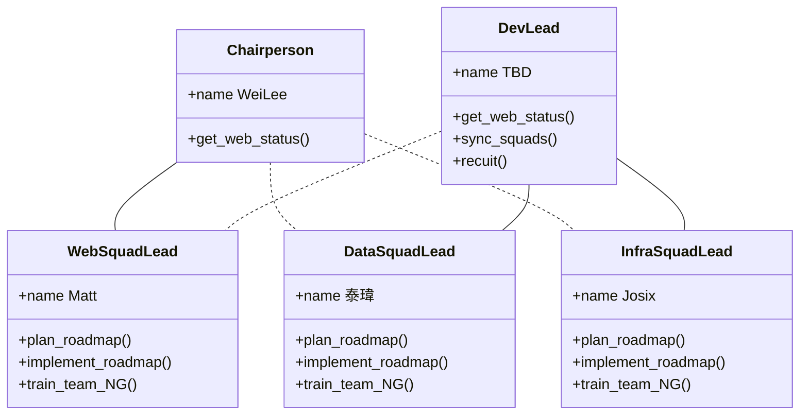
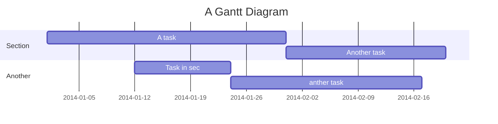

2021 開發組組織架構與主要推動工作
============================


## Table of Contents

[TOC]

## 組織架構



1. 網站小隊為雙 report，直接 report 給大會主席與開發組長；資源競爭時，以主席、大會網站需求為較高考量 priority。
    - 實線 Chairperson 、虛線 Dev Lead 
2. 資料與建設小隊，也是直接雙 report 給大會主席與開發組長；但資源競爭時，以開發組長意見為主。
    - 實線 Dev Lead 、虛線 Chairperson


User story
---

- Refactoring pycontw 2016 module
- Refactoring pycontw 2016 table
- ...more

```gherkin=
Feature: Refactoring pycontw 2016 module

  # The first example has two steps
  Scenario: Maker starts a game
    When the Maker starts a game
    Then the Maker waits for a Breaker to join

  # The second example has three steps
  Scenario: Breaker joins a game
    Given the Maker has started a game with the word "silky"
    When the Breaker joins the Maker's game
    Then the Breaker must guess a word with 5 characters
```


```gherkin=
Feature: Refoctor pycontw2016 table
  As a Shopper
  I want to put items in my shopping cart
  Because I want to manage items before I check out

  Scenario: User adds item to cart
    Given I'm a logged-in User
    When I go to the Item page
    And I click "Add item to cart"
    Then the quantity of items in my cart should go up
    And my subtotal should increment
    And the warehouse inventory should decrement
```

> Read more about Gherkin here: https://docs.cucumber.io/gherkin/reference/


Project Timeline
---

- Refactoring pycontw 2016 module / table <== before CfP




> Read more about mermaid here: http://mermaid-js.github.io/mermaid/

## Appendix and FAQ

:::info
**Find this document incomplete?** Leave a comment!
:::

