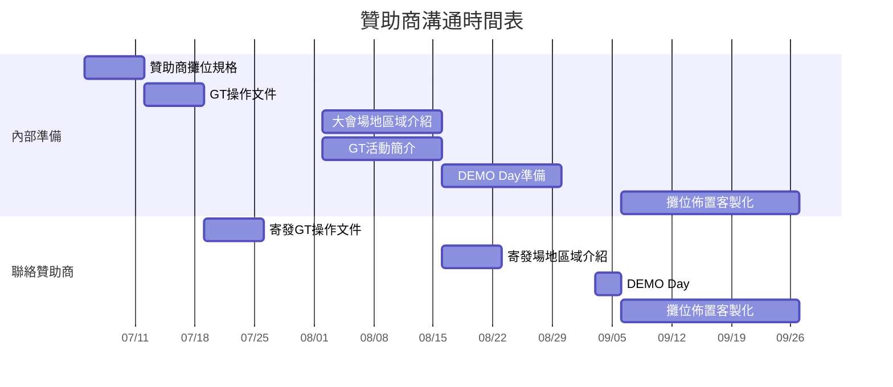

🔙 Back to [歷年 PyCon TW Organizing 共筆](/ryPr7SFyP/%2FHM5mHCFKQCu7-W5ea8ITcw%3Fview)  
🔙 Back to [PyCon TW 2021 Organizing 共筆](/Wb9vQrfJQk-5tPoPR23hwA)

# Gather Town Meeting Minutes

[TOC]

## Bi-Weekly Meeting (20210905)

:::info
- **Location:** Home
- **Link**: https://meet.google.com/tfe-gqos-uop
- **Date:** 14:00 Sep 05, 2021 (TST)
- **Participants:**
    - Allen
    - Wei
    - Ray
    - tumi
    - Vivian
    - David
    - Gobby
    - Jojo
:::

### Discussion
- 地圖目前的進度
    - [Space 1](https://gather.town/app/y7iXkqcZ2cUe43Mr/PyCon%20TW%202021%20Space%201) (password: `pycontw2021venue`)
    - 預計 9/11 Ready to go
- Sponsor Demo Day 狀況
    - 錄影：https://youtu.be/cZ3Z8Bfz-zA
- Unboxing day
    - 週末開始發送 Unboxing day 社群邀請+擺攤邀請 -> Gobby
    - 主持人 -> Gobby
        - 執行夥伴 -> JOJO / Allen / 場務組(課間遊戲)
        - 找夥伴
            - Fish -> JOJO/Allen/David
            - 議程組 -> Jordan / Peter / Winnie -> Wei 
    - 壓力測試
    - 體驗內容 -＞ Gobby&jojo路線規劃，體驗大地遊戲1/4的支線劇情&課間團康活動
    - 會場密碼：ihaveaPYdream
    - 回饋問卷 -> Tumi
    - 流程
        - 19:30 
        - 19:40-19:50 廣場集合
            - 歡迎 -> Wei
            - 解說 -> 主持人
            - 分族群
                - 兩團（先遊戲解說）
                    1. （輕遊團新手教學）純新手學完再帶走一次解任務、會場
                    2. （自由行）已經會用的 -> 不用帶，你自己去玩
        - 20:30 解完任務到休息區發放問卷、分享心得、聊天（志工把回饋紀錄在內部表單）
        - 會場開放到 00:00
    - 不開放體驗的區域，用前景黑布or迷霧蓋起來 -> 增加神秘感
- 課間活動（課金活動？！ 😱）
    - 10-15 mins
    - 10/2
        - 午餐時段最後 20 分鐘
        - Job fair 最後 20 分鐘
    - 10/3
        - 午餐時段最後 20 分鐘
        - Open space 最後 20 分鐘
    - 遊戲參考：https://gartic.io/
- 新手教學場
    - 複製到另一個空間，不會跟主會場連接 -> for security issue -> Allen
    - 行前信、FB Post -> Gobby / Allen <- PR
        - 到時候可以分享到 Gather Town Taiwan 的社團
    - 英文說明指引
        - Lyra -> Allen
    - Wording fix
        - 到時候會需要大家統一用字，原則上都是 Py後面的第一個字大寫  
          e.g., PyCast, PyCon TW, PyNight
    - 贊助看板要露出？ -> 待確定
        - 問 pinchun
        - 多宣傳的，沒有 promise
- 場地頁面網站進度 -> Anan -> Allen
    - 預計 9/18 上線
- gather town 會有推播訊息嗎？
    - 需求表單 -> JOJO設計，找gobby.allen確認架構，請各組填寫。後續要再調配。
- 有什麼東西希望 Wei 在 Opening / Closing 要提到
    - ~~操作指引(最重要的幾個)(Ghost mode?)~~
    - 哪裡有活動(在 gather town 中有獨家活動「講者互動區」，「閃電秀」、「open space」，會場超酷）
    - e.g., where's the info desk?
    - Wei 會再開文件給大家填需求
    - Closing
        - 各組截圖，丟到某資料夾 -> Wei 開，這件事的 organizing 交給 Andy
            - by topic 再分一層
            - on conference PR post -> tai/宗翰

### A.O.B. （臨時動議）
- 社群擺攤數量限制
    - 5 or 10 個 （先說先搶先贏，不說數量）
        - 截止時間： 9/14 (Tue) 23:59
        - 不主動說 9/18 還可以再加
        - 物件：社群名稱、聯絡資料、去背橫向logo、連結（對NPC志工按X）
    - 通知
        - 跟社群開箱日一起寄出去
        - 表單 -> Gobby
        - ideally sent before 9/7
        - demo day 素材：https://youtu.be/cZ3Z8Bfz-zA
- MO 娘 VTuber 合作？
    - Gobby 向 MOPCON 提出 Unboxing Day 合作
        - 主持人用固定路線帶
        - 也許可以停在 MOPCON 的攤位
    - 社群攤位
        - 可以給設計權
- 下次開會時間
    - 9/11 晚上 8:30
        - 地圖最終確認！
        - 規劃 Unboxing day
- 主會場密碼？
    - 會議當天會直接使用白名單，不須密碼


## Bi-Weekly Meeting (20210821)

:::info
- **Location:** Home
- **Link**: https://meet.google.com/kdg-xjvr-irp
- **Date:** 14:00 Aug 21, 2021 (TST)
- **Agenda:**
- **Participants:**
    - Wei
    - Allen
    - David
    - Jordan
    - JoJo
    - Ray
    - tumi
    - Gobby
    - Joe
- **Minutes Taker:**
:::

### Discussion

- 目前地圖的狀況
    - [GT+大地遊戲流程](https://www.figma.com/file/mhBX2ZQGJfck7g79MIeOpq/Pycon-2021-GT-%E5%A4%A7%E5%9C%B0%E9%81%8A%E6%88%B2?node-id=0%3A1)
        - 廣播需求
    - [GT Map](https://www.figma.com/file/kGREZeV8F5oy3kzRSZBUgX/Pycon-2021-GatherTown-construction?node-id=0%3A1)
- 已完成 [Sprint 場地](https://gather.town/app/6NKcuFatDrrfpAgY/PyCon%20TW%20Sprint%20Venue)+推廣到地方社群
    - 想問後續有收到任何社群的回饋嗎？
    - 麻煩大家幫忙 debug
    - 需要上 Gather + sponsor 的 LOGO 
    - 活動當天需要白名單？[name=坤賢]
- 寫信開通接下來的 [場地需求](#Discussion2) [name=David]
- Gather town 場地頁面@pycontw 網站
- 若今年報名人數少，是否考慮只開放一個 space
    - 拜託不要報名人數少 QQ
- 規劃 gather town 如何提醒哪個空間有重要的活動
    - gather town 置頂訊息
    - 大聲公
- Opening / Closing 融入世界觀？
    - talk 埋活動要素？
        - 由主持人提供
        - 但我們需要引導會眾多去聽 talk 嗎？
            - 繼續衍生如果我們想影導會眾去開 open space 呢？
        - 過場動畫 (在每場議程開始前播放 (大家衝進議程廳的影片))
    - feature request -> [name=Ben]
        - 符合 gather town 風格的 slide template
    - 在gather.town上鼓勵會眾多進行互動
        - 誘因
- [贊助 Demo Day](https://discord.com/channels/752904426057892052/845976899846275083/878204179439583262)
    - 讓贊助商熟悉 GT 場地
    - 若其他部分還沒完成，可以簡單標記其他區域
    - deadline: 8/28
- Gather 匯入會眾白名單
    - Sprint Day -> 向 [name=坤賢] 確認
        - [ ] 所有參與人員的名單 (From 註冊組)
        - [ ] 確認是否有贊助商要參與？
        - [ ] 最晚 09/25 匯入名單
    - Speakers Rehearsal
        - [ ] 手上已有講者的mail
        - [ ] 可以在 09/11 前先匯入講者的嗎 (Jordan可以自行匯入嗎)
    - PyCon TW 2021
        - [ ] 贊助商擺攤人員(From 贊助組)
        - [ ] Keynote (From 議程組)
        - [ ] 會眾名單 (From 註冊組)
        - [ ] 最晚 09/26 匯入名單？
- [PyCon TW 2021 Unboxing Day](#%E8%A8%8E%E8%AB%96%E5%BF%97%E5%B7%A5%E8%A8%93%E7%B7%B4%E5%85%A7%E5%AE%B9-20210808)
    - 邀請日期：9月初
- 到會期前的活動
    - 新手教學場 (全天最低人數限制)
        - 時間：9/12
        - 對象：會眾
        - 需求：提供會眾熟悉 Gather.town 基本操作
        - 搭配行前信
    - Sponsorship Demo Day (全天 100 人)
        - 時間：09/03 - 09/04 (12:00 - 13:00)
        - 對象：志工 / 贊助商
        - 需求：年會主場地 (2 Spaces)
        - [Space-1]( https://gather.town/app/y7iXkqcZ2cUe43Mr/PyCon%20TW%202021%20Space%201)
        - [Space-2]( https://gather.town/app/zrrivgpwheEOCy8e/PyCon%20TW%202021%20Space%202)
    - PyCon TW 2021 Unboxing Day (全天 100 人)
        - 時間：09/18 (19:30 - 21:00)
        - 對象：志工 / 受邀的社群
        - 需求：年會主場地 (2 Spaces)
        - [Space-1]( https://gather.town/app/y7iXkqcZ2cUe43Mr/PyCon%20TW%202021%20Space%201)
        - [Space-2]( https://gather.town/app/zrrivgpwheEOCy8e/PyCon%20TW%202021%20Space%202)
    - PyCon TW 2021 Sprint Day (全天 100 人)
        - 時間：09/26 (09:00 - 16:30)
        - 對象：Sprint 參與者
        - 需求：Sprint 場地
        - [Gather](https://gather.town/app/6NKcuFatDrrfpAgY/PyCon%20TW%20Sprint%20Venue)
    - PyCon TW Rehearsal Day (全天 100 人)
        - 時間：10/01 (19:30 - 22:00)
        - 對象：志工
        - 需求：年會主場地 (2 Spaces)
        - [Space-1]( https://gather.town/app/y7iXkqcZ2cUe43Mr/PyCon%20TW%202021%20Space%201)
        - [Space-2]( https://gather.town/app/zrrivgpwheEOCy8e/PyCon%20TW%202021%20Space%202)
    - PyCon TW 2021 (全天 500 人)
        - 時間：10/02 - 10/03
        - 對象：志工(活人XD) / 講者 / 贊助商 / 會眾
        - 需求：年會主場地 (2 Spaces)
        - [Space-1]( https://gather.town/app/y7iXkqcZ2cUe43Mr/PyCon%20TW%202021%20Space%201)
        - [Space-2]( https://gather.town/app/zrrivgpwheEOCy8e/PyCon%20TW%202021%20Space%202)

### A.O.B. （臨時動議）
- 下次開會時間

---
## 討論志工訓練內容 (20210808)

:::info
- **Location:** Home
- **Link**: 
- **Date:** 21:00 Aug 08, 2021 (TST)
- **Agenda:**
- **Participants:**
    - David
    - Allen
    - Vivian
    - tumi
    - Gobby
- **Minutes Taker:**
:::

### Discussion
- 提前釋出新手教學場
- ==中秋烤肉開箱 Day==
    - 9/18 PM 8:00 (19:30 開始集合)
    - 非公開活動
    - 參加的人上來體驗遊戲、有人帶團踩點（要自由行也可以）
    - TA: 志工 + 社群朋友
    - show 場地 + 催票
    - 流程
        - 集合時間 30 分鐘
        - 活動說明 10 分鐘
        - 新手教學 30 分鐘（包括新手志工）/第一團出發 30 分鐘
        - 新手出團 30 分鐘（包括新手志工）/第一團回來先收集意見/聊天/填問卷
        - 新手團回來收集意見/聊天/填問卷
    - 社群名單
        - Py社群：台北Py, 新竹Py, 台中Py, 台南Py, 高雄Py, 花蓮Py, 南投Py, PyLadies, Django girls Taipei --＞[name=Joe]
        - Conf: **COSCUP, SITCON, MOPCON, g0v**, HITCON, JSDC(?)
    - 預定邀請時間
        - 9/4 邀請（各組志工、社群）
            - Py社群--＞Joe
- 風格
    - 夢一場
- 補充：歷年售票人數
    - 2018: 663 人
    - 2019: 675 人
    - 2020: 441 人
---
## Bi-Weekly Meeting (20210807)

:::info
- **Location:** Home
- **Link**: https://meet.google.com/gpp-zdws-ddn
- **Date:** 14:00 Aug 07, 2021 (TST)
- **Agenda:**
- **Participants:**
    1. Allen
    2. David
    3. Vivian
    4. Joe
    5. Gobby
    6. Ben
    7. JoJo
    8. Ray
- **Minutes Taker:**
:::

### Discussion

- 確認目前地圖的狀況
- [會眾行為模式心智圖 (邀請碼:2767)](https://gitmind.com/app/join/3cf2923142)
- Sprint 場地建造並將 GT 推廣到地方 Py 社群
    - Goal
        - 提前教育會眾使用 GT
        - 宣傳 PyCon (售票資訊等等)
- 目前需要行銷規劃的活動
    - 志工訓練 + 社群交流
    - 新手教學場
- 到會期前的需求
    - 新手教學場 (全天最低人數限制)
        - 時間：預計年會前一個月
        - 對象：會眾
        - 需求：提供會眾熟悉 Gather.town 基本操作
    - Sponsorship Demo Day (全天 100 人)
        - 時間：09/03 - 09/04
        - 對象：志工 / 贊助商
        - 需求：年會主場地 (2 Spaces)
    - ==PyCon TW 2021 Demo Day (全天 100 人)==
        - 時間：09/18
        - 對象：志工 / 受邀的社群
        - 需求：年會主場地 (2 Spaces)
    - Sprint (全天 100 人)
        - 時間：09/26
        - 對象：Sprint 參與者
        - 需求：Sprint 場地
    - PyCon TW Rehearsal Day (全天 100 人)
        - 時間：10/01
        - 對象：志工 / 講者
        - 需求：年會主場地 (2 Spaces)
    - PyCon TW 2021 (全天 500 人)
        - 時間：10/02 - 10/03
        - 對象：志工 / 講者 / 贊助商 / 會眾
        - 需求：年會主場地 (2 Spaces)
- 備援方案
    - 與贊助組討論備案 discord 平台使用 (要不要加開語音頻道)
        - 先開 Google meet 備用

### A.O.B. （臨時動議）

- 下次開會時間 8/21 (六) 14:00
- COSCUP 使用心得
    - 幫所有人設定 Gather.town 名稱
    - 多人同時螢幕分享的時候有一點卡但可以接受
    - 兩人的 Private Space 使用率蠻低 (可以用 Bubble)
    - 路過攤位區再分享 Talk 的時候會眾沒關麥克風經過會一陣尷尬
    - 無限走廊迴圈

---

## Weekly Meeting (20210725)

:::info
- **Location:** Home
- **Link**: https://meet.google.com/byz-xudz-ikx
- **Date:** 14:00 Jul 25, 2021 (TST)
- **Agenda:**
- **Participants:**
    1. Wei
    2. David
    3. Allen
    4. Jordan
    5. Joe
    6. Ray
    7. Gobby
    8. tumi
- **Minutes Taker:**
:::

### Discussion
* 來看看中研院重置狀況如何了
    * [Figma draft](https://www.figma.com/file/6ooo1T2zFVMaW6CpmoPbr9/2021-PyCon-Map?node-id=0%3A1)
* [Young Inspirers 場地開通](https://trello.com/c/ng5DFvws)
* Workflow
```flow
st=>start: 開始
e=>end: 10/02 議程當日

op1=>operation: P1.1 場務：產出 Figma 雛形，整合議程、贊助需求與會眾行為模式(休閒空間) (07/18－07/25)
op2=>operation: P1.2 設計：開版(包含優化空間)與設定 Design System (07/26-08/08)
op3=>operation: P1.3 場務/設計：在 Figma 上先放置好非互動物件 (08/09-08/22)
op4=>operation: P2.1 場務：匯入背景/設定基本地磚及互動物件/Gather.town場地說明文件(文件/影片)
行銷贊助：大地遊戲、互動遊戲 (08/23-08/29)
op5=>operation: P2.2 場務：Gather.town場地說明文件(文件/影片)/測試流程Mission
行銷贊助：贊助攤位 (Sponsors Demo Day) (08/30-09/24)
op6=>operation: P3 最後驗收 & 壓力測試 (09/25-10/01)

st->op1->op2->op3->op4->op5->op6->e
```

- 互動遊戲的進行方式 (場務/行銷企劃)
    - 利用 Gather.town 現成提供的遊戲進行
    - 歡迎行銷組提供各種玩法
    - idea: 可以考慮 gather.town的dungeon escape那張地圖的遊戲玩法?
- 最後驗收與壓力測試 (行銷企劃)
    - 時間預計在大會前一周的某一天
    - 目前想到的形式：
        - ==方案一：社群交流與志工訓練 (Prefer)== 
            - 志工訓練
                - 讓平時比較沒接觸 GT 的志工們能夠在會期前對場地熟悉
            - 社群交流
                - 邀請社群朋友提供建議和分享之前的活動經驗
                - 協助測試 Gather.town 的體驗流程 (Mission)
                - 搜集大家對 PyCon TW Gather.town 的反饋
        - 方案二：前夜派對 (線上啤酒杯交流)
            - 可以預先知道今年買票的會眾參與度多高及增加熱度
            - 如果處理得不好，可能會拉低會眾對會期的期望值
            - 考量是否還有多餘的人力？
            - 是否與 Pynight 性質類似而有衝突？
- ==Speaker Rehearsal Day with MICARE (Day 0：10/01)==
    - 測試 YouTube 直播訊號以及到 Gather.town 之間的連線
    - 邀請講者先進行 Rehearsal 之後一起參與活動
    - 場外的 Speaker Q&A
- 月會可以測試 Gather.town (暫定9月可能比較適合)
- 3 大 conern
    1. 壓測
    2. 志工訓練
    3. 會眾訓練 -> 額外的 gather town 教學地圖？（e.g., [初鹿牧場](https://gather.town/app/EaFvGYXvo89mmKTx/ChuLuRanch)）
        - 從入口到中研院的路口
        - 另外的一個空間，不用人數限制。
        - 可以有好幾個同樣的設計的空間 <- 會眾不被期待在入口教學空間互動
        - 大會地圖也會新增傳送點到新手教學空間
        - 行前信：要提到可以調小環境音
- 請中研院的老師一起分享
    - Goal
        - 紀念 10th PyCon TW
        - 也算是感謝中研院歷年借我們的場地
    - Not our goal
        - 因為這樣拿到超多會眾

### A.O.B. （臨時動議）

- 酒精空瓶其實在裝填上是較為困難的（因為開口很小），會需要透過針筒或滴管才能完成裝填，可能會使體驗變得很差
    - [name=Wei Lee] 如果沒辦法換版型的話，聽起來附上漏斗是個好作法，如果都不行的話，好像也沒辦法 🤔
    - [name=David Lu] 確認廠商是否提供填裝器具以及報價，最晚八月第一週確認。
- 遊戲進行分為攤位遊戲和大會遊戲，是否有機會整合？因為大會遊戲主要是用來採點，把人流導到我們希望把人導過去發現場地的亮點並進行解任務。
    - 攤位遊戲：導人流到攤位
    - 大會遊戲：額外的體驗遊戲
        - 要考慮時間
            - E.g., 限時任務
- 議程外 Q&A
    - 要有議程組的人帶講者
    - or panel like event (需要主持人host)
    - 導講者到比較開放的space繼續QA? (open space?)
    - 設計額外 Private space -> 靠近贊助商

---

## Let's sort our what's unclear abour gather town

:::info
- **Location:** Home
- **Link**: https://meet.google.com/bzz-owcc-ige
- **Date:** 22:00 July 17, 2021 (TST)
- **Participants:**
    1. Wei
    2. Gobby
    3. Pinchun
    4. Allen
    5. Jordan
    6. Yucheng
    7. David
    8. Liyu
- **Minutes Taker:**
:::

### Discussion

* 分工不夠清楚
    * by Wei
        * 場務： 蓋 gather town 
        * 議程： 提出議程相關需求
            * [議程組 Gather Town 需求](https://hackmd.io/@pycontw/Byi2hyM9w/%2F6EMC_Er4TsCCwPNtosrz6w%3Fview)
        * 贊助執行： [提出攤位需求](https://hackmd.io/63vO1itsTFqDcyEvwH4-mA)、大地遊戲
        * 企劃： 大地遊戲
            * 是否跟贊助商攤位遊戲整合，需要知道各組在地圖上的期望和限制
            * 大地遊戲
                * 贊助組會own 攤位打卡的活動
                * COSCUP 每個攤位前面有通管密語，輸入 google 表單
                    * 取代攤位打卡
        * 設計： gather town 流程最佳化、上述活動外能讓會眾互動更好的方式，
            * 大會小彩蛋
                * nice to have, no plan so far
                * [coscup](https://docs.google.com/presentation/d/e/2PACX-1vQ1hvHDWM0BH1DNfwOMaPRDdMEyHY5I0U7Cz8jNaHh8GMg-9ziRDpo0bi02SMmVczfdPSgdv-lmifq9/embed?start=false&amp;loop=false&amp;delayms=3000&amp;slide=id.ge3e210e770_0_80&amp;usp=embed_googleplus&slide=id.ge3e210e770_0_306)
    * Example: 贊助執行提出徵才牆需求，由場務將它蓋在 gather town，蓋之前可以先跟設計討論蓋在哪可能比較多人會過去，或蓋之後設計再來 review
* 設計上的優先考量與順序是什麼
    1. 提高會眾對 gather town 的黏著度（e.g., 大地遊戲必須在 gather town 進行）
        * 建立講者 QA 專區，讓會眾可以在議程結束後與講者交流，交流的時限不限，所以可能需要多間 QA 專區
        * 讓議程的 QA 環節在 Gather 上執行。
    2. 盡可能讓會眾接觸到所有贊助商
        * 大地遊戲送天龍書局的書
* 尚未釐清的項目們（？）
    * 建立會議廳嗎？
        * 對，要建立 R0, R1, R2, OpenSpace, 講者 QA 小房間會議廳
    * 兩個 space 的結論？
        * 要兩個空間沒錯 (兩個不同的 Gather Town Link)
            * 一個空間上限 500u 
            * 要是其中一個空間（會議廳）爆炸就叫會眾去 YT 看議程，QA 就換到 Discord
            * 兩個 Space 需要是不同的會議廳與其他功能廳
            * A Space - R1 - 最大廳, OpenSpace, idle room, 講者 QA 小房間, 贊助商攤位A
            * B Space - R2, R3 小廳, 會眾出生點, 贊助商攤位B
        * 7/18(日) 例會需要測試議程中錄影將在 Gather Town 遇到的問題回報給官方
        * 補充：會議廳中可放 TV embeded 直播

* [name=pinchun, Allen] 決定轉為線上會議之後大家還沒有建立跨組間的工作默契，容易掉球/沒跟到最新的討論，建議是不是就幾個大項目讓某個組別主要負責其他組別support, 或是清楚拉出需要被loop進討論串的人員
    * PySafe 紀念品 [name=贊助, 設計, 場務]：贊助這邊只負責把設計的成果/金流和贊助商溝通
        * 其他現有贊助項目無關的發想（？）
    * 大會時間表：想知道對於Demo Day, 壓力測試, Rehersal 的時間排定，有幾次, 有哪些組別需要involve 
        * 誰要去聯絡gahter town 升級連結? 
        * 之前都是贊助組在聯絡gather town 現在贊助方案已經確定，贊助組會專注在回饋贊助項目
    * Gather Town: 贊助的時程表如下


* [name=Gobby] 綜上所述，想徵求專案小組或整合資訊的PM必要性：
    * Trello: https://trello.com/invite/b/6jUMvHg5/63115a74594ce218cb693b3790de527b/gathertown-team
    * Gather 跨組別 Host - Allen, David
    * 專案小組成員美術 - Ben,
    * 場務 - Ray,
    * 贊助 - 品淳,
    * 議程 - Jordan
    * 行銷企劃 - Gobby

### Reference

### A.O.B. （臨時動議）

### Action 

 1. 下次 Gather 跨組別會議時間 - 7/25 PM 2:00~