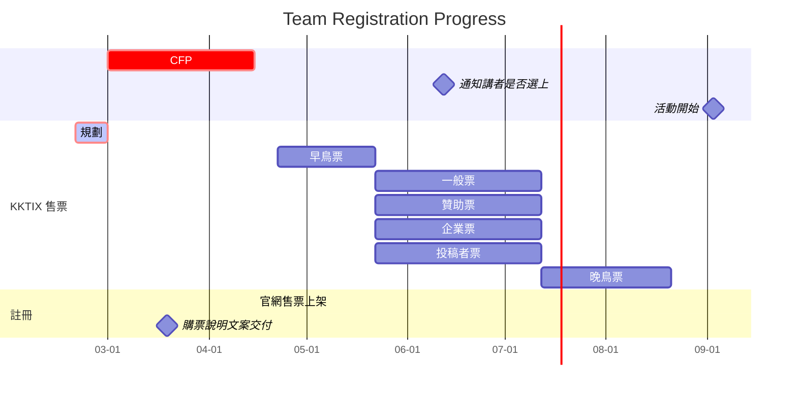
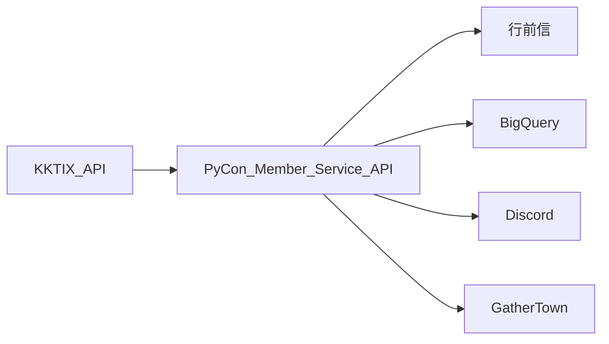

:e-mail: 對外溝通 email:
registration@python.tw

🔙 Back to [PyCon APAC 2022 Organizing 共筆](/F4qRbwIsQXWH5B6cZ6Pzyw)
🔙 Back to [PyCon APAC 2022 Registration 雲端硬碟]([/F4qRbwIsQXWH5B6cZ6Pzyw](https://drive.google.com/drive/folders/14kxhCH0ADXfOFYPtCxvslCHS3gMFqsUB?usp=sharing))
🔙 [註冊表單](https://docs.google.com/spreadsheets/d/1Rm68LLIB3YEdfinpTmORZmZAfo2-o50Wcc9ZJ0EZOpc/edit?usp=sharing)
🔙 [購票文案](https://drive.google.com/drive/folders/1wgqagyWRK15NE5cdgmIoD51lQBzWFSrY?usp=sharing)
🔙 [票價估算](https://docs.google.com/spreadsheets/d/1PzVEXg8OQCRZxai27EI81Z5lxYHJ6H5vBU2P-3BNisw/edit?usp=sharing)
🔙 [邀請碼清單](https://docs.google.com/spreadsheets/d/1tDmEgdrCoBQMFO5NwVfgoOYwOiPYFxFcUY1aoSesRow/edit?usp=sharing)

# 2022 註冊組會議紀錄

[TOC]

---
[Google Calendar](https://calendar.google.com/calendar/embed?src=t9r9qd19ju6760neai5gilt1v8%40group.calendar.google.com&ctz=Asia%2FTaipei)
<iframe src="https://calendar.google.com/calendar/embed?src=t9r9qd19ju6760neai5gilt1v8%40group.calendar.google.com&ctz=Asia%2FTaipei" style="border: 0" width="800" height="600" frameborder="0" scrolling="no"></iframe>

# Meeting 08/18/2022
:::info
- 地點：線上會議
- 連結：https://meet.google.com/vxb-njst-bqj
- 日期：2022/07/21 21:30
- 出席人員：
    - [name=Yucheng]
    - [name=GTB]    
    - [name=Li-Ying]
    - [name=Kuan]
    - [name=弘哲]
- 未出席人員:
	- [name=Connie]
	- [name=Derick]
:::
## Agenda
### 行前信狀況
- 各個組還在確認，跟更新內容，預計 8/22 會敲定 Freeze
### 隨買即用
- 發信部分由 [name=henry] 處理，需要確認 8/22 前確認是否能使用
- GATHER TOWN [name= angus] 註冊的部分好像還沒處理，待確認
- YOUTUBE 也待確認
### 提前一周開放觀看
- 如果是 09/03 提前一周為 08/26，非常倉促，先確認確切時間，未定的話延到 08/28 禮拜一比較好
### BUNDLE PASS 售票
- 目前在我們這 MY 賣票為0
- 需要跟 NZL 和 MY 確認賣票
### 贊助講者票掉球
- 贊助講者沒發到邀請碼，現在補發了預計 8/26 前收單
- 也請 MATHEW 保留 pyckage 數量
### 企業票
- Netskope 跑來買企業票，因為團體企業票表單未關閉，所以成為最後一個團體購票的買者
### 講者票
- 最後三位就是不買，let it go ~
### 多筆訂單問題

### 8/26 招募組和我們一起組聚
https://goo.gl/maps/gN5PgJMXGeg7DMHm8
8/26 19:30 - 21:00
### 8/27 多重宇宙趴

## Action
- [name=Li-Ying] 8/20 詢問隨買即用狀況
- [name=Kuan] 協助 MY NZL bundle pass 狀況，詳情請見 https://hackmd.io/@38LGz59GQ_Oc05A1dhAfYg/rk-C0Gp6c/edit
- [name=Derick,洪哲] 8/22 定版行前信
- [name= yucheng,GTB] 海巡

# Meeting 08/04/2022
:::info
- 地點：線上會議
- 連結：https://meet.google.com/vxb-njst-bqj
- 日期：2022/07/21 21:30
- 出席人員：
    - [name=Yucheng]
    - [name=GTB]
    - [name=Li-Ying]
    - [name=Kuan]
    - [name=Derick]
- 未出席人員:
	- [name=Connie]
	- [name=弘哲]
:::
## Agenda
### 售票相關
- 一般票截止
- 晚鳥票開賣時機
    - 是否立即開賣
        立即開賣，web 已經寫上架了要同步
    - 晚鳥是否降價，降多少？
        不降，降是為了期待人數變多，但是不確定是否會變多，而會影響之後訂票影響（總是在降價就跟狼來了一樣）
- PyConMY bundle pass
- 
- 售價 5500
- 企業晚鳥票開賣
- 企業票團體票停止受理（雖然可能會遇到趨勢大金主）
 

### Pyckage 統計
- 講者(Speaker)沒填要追
- 一般會眾已經有描述告知，不額外發文詢問
- 志工就慶功宴砸他臉

### 行前信
- 追一下場地組找 [name=Fish]或[name=Ray]
- 議程組追殺 [name=Connie]
- 追殺[name=Leewei]放 PSF member 資訊

### Mopcon 換票
- 已經發票給 [name=Gobby]
- 去找 [name=Gobby] 討 Mopcon 票
### 訂單多張票 email 追票
- 我們是一張票對應一個 email ，現在有一個 email 有多張票狀況要下去查
## Actions
- [name=GTB]企業團體票跟巡視 support
- [name=GTB]賣 bundle pass MY
- My 回信跟 行前信翻譯[name=Kuan]
- 行前信下次開會前完成 [name=弘哲] [name=Derick]
- 去幫忙追 Mopcon 換票[name=Li-Ying]
- 隨買即用[name=Li-Ying, Yucheng]
- [name=Connie] 幫忙追 [name=Wei] 有沒有發 pr 
- [ ] 回信 Ivy
- [x] 處理過期活動 https://groups.google.com/a/python.tw/g/registration/c/wN3g9V052s0

# Meeting 07/21/2022
:::info
- 地點：線上會議
- 連結：https://meet.google.com/vxb-njst-bqj
- 日期：2022/07/21 21:30
- 出席人員：
    - [name=Yucheng]
    - [name=GTB]
    - [name=弘哲]
    - [name=Connie]
    - [name=Li-Ying]
    - [name=Kuan]
    - [name=David]
- 未出席人員:
	- [name=Derick]
:::

## Agenda

### 售票相關
* 最後一週的售票宣傳安排
#### PyNight 前夜派對
* 是否要統計參與者並當天發放

#### OSCVPAss 討論
* 社群邀請碼是否要延期？ 會遇到包裝時間 8/3，延期時間取決包裝時間
* 社群邀請碼的定價？ 1900
* 社群邀請碼是否要包含 Pyckage? Y
* 去跟 OCF 追蹤

### 講者票
* 講者票以及貢獻者票的追蹤進度
* 講者票打統編的政策

### 企業團購票
* 請對方直接提供資料，在對方付完款後我們直接幫他成立訂單
* 因為接洽廠商會較遠，所以可能會在 8/1 後購買的訂單會提醒可能會在大會後拿到
* 企業團體票 deadline，8/1之前洽談的有 Pyckage，之後的沒有 Pyckage
* 之後不包含企業票?

### Malaysia Bundle Pass 討論
* 為什麼是我們賣票，理由是?
* 對方希望我們賣票，他們折扣碼
* 我們希望對方負責賣票，我們負責開通權限
* 訂票策略上很不適合
* 因為我們賣票已經進入尾聲了，可能不太適合促銷
* 實體票包線上票比較適合
* 因為會眾大宗為台灣人，不太適合賣馬來西亞實體票
* 可以幫他寫宣傳文幫忙推銷為利益交換( 可能推 twitter )
* 不用擔心換匯問題，扣稅金都由我們承擔

### 個人贊助票官網
* 是否要上官網? yucheng 加班
* 若有，將會準備個人贊助票小編文

### 行前信進度 
* 行前信進度 0%
* 議程組、場務組負責文案，要去追
* Data team 串接，隨買即用的開發進度

### Pyckage
* T-Shirt 的統計數量
* 個人貢獻票神秘內容物

### 邀請碼寄送
* 國泰跟敦陽資訊的團體票進度>洽談中
* FA 的邀請碼寄送進度>已交給 Rock 寄送

### 贊助邀請碼
* 後面追加的都未使用，Li-Ying 有定時追蹤

### KKTIX 設定
* KKTIX 的範例地址有沒有要修改
* KKTIX 說明上面還有寫 PySafe
* KKTIX Everyone pays rule 連結壞了>

## Action
* 拿到補助，看月會後來吃個什麼
* 2022/07/24 的大會例會也到三重帝寶集合？可能會跑去吃飯就不來了
* 大家記得上傳照片到工作人員資料夾 https://discord.com/channels/752904426057892052/900709461088423996/996156566925484142
* 隨買即用串接[name=Li-Ying]
* 行前信處理 [name=弘哲][name=Derick]
* 馬來西亞 bundle pass[name=Kuan]
* 個人贊助票官網 [name=Yucheng]
* 個人贊助票宣傳 [name=Connie]
* 企業票流程改善 [name=Leila][name=GTB]
* 企業票回覆 [name=Leila][name=GTB]
* 衣服數量統計 [name=弘哲] 8/3號 deadline
* 跟贊助跟議程講者票兌換進度 [name=Li-Ying] 希望 8/1 前兌換完成

# Meeting 07/07/2022
:::info
- 地點：Google meeting 線上聚會
- 連結：https://meet.google.com/vxb-njst-bqj
- 日期：2022/07/07 21:30

:::
## Agenda
### 投稿者 without pyckage
### KKTIX 表單新增
因應大會場地 Gather Town 的年齡政策，請確認您已滿 18 歲。[必填打勾]
You are already aware that Gather policy requires participants to be at least 18 years old.
### KKTIX 頁面新增注意事項
By Gather policy, the participants are required to be over 18 years old.
因應大會場地 Gather Town 的年齡政策，請確認您已滿 18 歲。
### 投稿者票 without Pyckage
總召想要沒有 Pyckage 的投稿者票 票價待訂
### 邀請碼紀錄
#### APAC 邀請碼
給個 APAC Organizer 要給兩張邀請碼，已開表單
### 衣服 size 
Li-Ying 麻煩再追一下
### 行銷信紀錄
TOTAL:2,226
OPENED 814 recipients     (37.9%)
CLICKED 107 recipients   （5%） 
UNSUBSCRIBES 4 recipients （0.2%）
SPAM COMPLAINTS 0 recipients
### 行前信 kickoff
主要以參加方式為主
### 邀請碼轉換率
講者還有1/2 沒買票
志工票還有1/3 沒買票
企業票83%未購買 （57/69未使用）
## Action
- 繼續宣傳 [name=connie] 
- 邀請碼管理, 衣服 size 追蹤 [name=Li-Ying]
- 行前信 [name=Derick]
- 行前信 [name=Yucheng]
- 寄信  [name=弘哲]
- Bundle pass[name=Kuan]

## 這週末去錄影的：
星期天
- [name=Kuan][name=GTB][name=Derick][name=yucheng]

# Meeting 06/23/2022
:::info
- 地點：Google meeting 線上聚會
- 連結：https://meet.google.com/vxb-njst-bqj
- 日期：2022/06/23 21:30

:::
## Agenda
### Bundle Pass
- 預期賣到對方截止時間 (對方 8/20 一定比我們早)
- 價格為雙方的票價加起來*50%以上
- 要提供售票消息給 NZL
- 希望不會打到一般票，故價格不會低於一般票售價
- 預計賣 3000 台幣左右
- 希望是打到非台灣也非 KIWI 原本的會眾(擴增客源)
- 打廣告要盡量避免現有客戶
- 行前信發送時間
- 如果有 APAC 相關問題才找我們
- 贊助商 logo 也放進去(算額外 bonus)
- GATHER TOWN 創建，以及會使用 youtube 和 gather town
- KIWI PyCon 會眾資訊取得方式
- 提供行前信寄送時間 range

### 個人贊助票
    
- 個人贊助票回饋
- 捐助贊助票票價的三分之一費用至 PSF *(扣除 20% 稅務)
    - 5000 (票價)/3 (捐助 PSF)*0.2 (扣繳稅額) = 1333
    - 捐出:1668(333為稅務)
- 在 PyCon 網頁顯示贊助名錄
- 在 Gather Town 顯示在著名人牆 (待討論)

### 行銷信

[x] 內文 Code Freeze
[] Teamplate 修改
[] 發送信想改成 organizers@python.tw
[] 發送一封測試信
[] 正式寄出給會眾
[] 設定平日 12 點或者晚上 7 點寄出

- klaviyo 的功能設定
    - 開信率

### 企業票行銷信
- 從贊助組拿到企業窗口，這些窗口已經寄送過企業贊助書，會排除已經贊助的廠商
- 贊助組跟 marketing 組
- 優先程度偏低

### 晚鳥票價格再議
- ~~2600 without Pyckage~~
- 等到一般票賣完再出來
- 不希望大家去買晚鳥票，不改價格，以防已經購買的人會有虧的感覺

### 一般票延期時長
- 7/12 後統計數量，將一般票改成固定數量
- 7/12 前一周發文通知，跟 marketing 行銷促銷協商
- 在場務包裝時間之前
- 跟 venue 喬包裝時間，希望能接受收到時間在大會之後，延長一般票購買時間
- 預設賣到7月底然後8月第一周前給場務 

### 講者名單寄送
- 剛從議程組拿到 51+4 位講者
- 重複的講者只寄送一個
- 要請議程去催購票希望能在 7/12 購買

### KKTIX 頁面
- 表單有 pysafe 改成 Pyckage
- 購票頁面加回  `PySafe 無法送達，如因填寫錯誤致未收到 PySafe，報名人須自行負責，大會恕不再另行補寄`

### 企業票
- 跟著一般票一起延
- 注意贊助商使用狀況

## Action

- 寄送講者票邀請信，預計 6/26 寄出 [name=弘哲, GTB]
- 行銷信 Template [name=Derick]
- 寄送行銷信，預計 6/28 寄出 [name=yucheng, 弘哲]
- KIWI PYCON 的 BUNDLE PASS 售票資訊 [name=GTB, 阿寬]
    - 票價包含哪些品項
    - PyCon APAC 2022 聯絡窗口 - organizers@python.tw
    - 舉辦資訊
- KKTIX 頁面調整 [name=GTB, 阿寬]
- 會眾 T-shirt 預估資料統計 [name=Li-Ying]
- 隨買即用系統 [name=Li-Ying]
- 講者票**邀請碼**使用追蹤 [name=GTB, 弘哲]
- 贊助商票**邀請碼**使用追蹤 [name=GTB, 弘哲]
- FB, Twitter, IG 行銷宣傳安排 [name=]
    - 售票倒數
    - 議程表出爐後宣傳一波
- 行前信準備 [name=Yucheng]

# Meeting 06/09/2022
:::info
- 地點：Offline 線上聚會
- 連結：https://meet.google.com/vxb-njst-bqj
- 日期：2022/05/26 21:30
- 人員：
    - [name=Yucheng]
    - [name=Li-Ying]
    - [name=GTB]
    - [name=twtrubiks]
    - [name=Derick]
    - [name=Connie]
    - [name=Kuan]
:::
## Agenda
### 新志工!
- [name=阿寬] 是新來的志工! 
- 被社團學弟推坑的

### 行銷信規劃
- [name=Yucheng] 行銷信延期到 6/17
- [name=Derick] email template，Outlook 小跑版但是整體內容呈現上沒有問題
- [name=Connie] 文案準備整合 6/12 會出一版，請 [name=Kuan] 幫忙一起協助
- [name=GTB] 近三年的已經做好了，人數感覺不夠，之後會改近五年
- [name=Yucheng] 敲板定案全英文信件
- [name=Derick] 行銷信要額外寫摘要

### 志工票
- [name=GTB] 我還沒把重複的給去除掉，可能會延到 6/12 寄送
- [name=弘哲] 準備志工邀請信件文案?用現有模板下去更改

### 隨買即用規劃
- [name=Li-Ying] 改版成 flask 版本
- [name=弘哲] 寄信系統驗證，非常完美
- [name=Li-Ying] 幫忙追一下 [name=David Jr.] 的 ESP 進度
- [name=GTB] 6/10 我們來寫 SPEC 吧 10:00-12:00

## Action

- [name=弘哲] 
	- 寄信
	- 改志工邀請碼模板
	- 重寄改版做測試
- [name=Derick] 
	- 繼續修模板
	- 一起來寫 SPEC QQ
	- api bot 每日的售票
- [name=Yucheng] 
	- 行銷信
	- 官網
- [name=Connie] [name=Kuan] 
	- [ ] pycon.tw 購票頁面 個人贊助票文案(初稿校對) 6/8
	- [ ] 行銷信 個人贊助票宣傳文案 6/12
	- [ ] 行銷信統整:初版中文 6/12, 英文 6/17
	- [ ] 個人贊助票小編行銷 6/19 之後 
- [name=Li-Ying]
	- [ ] flask 改版
	- [ ] 創建邀請碼
- [name=GTB] 
	- [ ] 統計 志工票、行銷信 mail list
	- [ ] 寫 SPEC
	- [ ] cloud function 權限，還有 API gateway 權限

# Meeting 05/26/2022
:::info
- 地點：Offline 線上聚會
- 連結：https://meet.google.com/vxb-njst-bqj
- 日期：2022/05/26 21:30
- 人員：
    - [name=Yucheng]
    - [name=Li-Ying]
    - [name=GTB]
    - [name=twtrubiks]
:::
## Agenda

### 目前售票狀態

* 官網資訊修改中 - Yucheng
* 個人票贊助票頁面增加，跟贊助票頁面協商，不行就放回購票頁面
* 企業團體票名單收集以及與財務對帳
	* 目前只接受團體購票至少 20 張以上
	* 去年轉線上後團體購票數量都減少了,超過 20 張只有國泰[name=Yucheng][name=弘哲]
	* 2022 改為 20 張以上才算企業票團購，這已經公告出去了，逝者已矣[name=GTB]

### 行銷信規劃

* [TimeLine](https://hackmd.io/MWMS4rVZR46YbvCBliSOYw#Time-line)
* 個人贊助票宣傳
    * 請 Connie 提供個人贊助宣傳以及放在官網的宣傳文案
* TA
    * 請 GTB 提供近三年的會眾清單 (企業票之外都要)
* 寄送系統
    * 需要請 Derick 產出 Template
        *  寫了一個基本版
        *  信的內容是什麼
        *  要怎麼變成可重複利用的模板
        *  發現很酷的套件 [cloudhq](https://chrome.google.com/webstore/detail/free-html-editor-for-gmai/ioinaaeeacahcmbgfmeaaofhfkijpdeb)
        *  所有圖片都要兩倍大(jpg,jpeg,png)
        *  header, banner 要請 [name=Moto]再特製
        *  要注意 outlook 會不會跑版，請有 outlook 的 [name=Li-Ying] [name=Connie]
    * 需要請 弘哲 使用 Mailhandler
    	* html template 之後要用 mailhandler 測試圖片是要附件攜帶是否OK

### 志工名單收集狀況
* 所有組長大致都有填寫，可以準備發第一波志工信
* 開始寫志工信

### 隨買即用規劃
* 我試了一個禮拜的 cloud function 目前還是打不通 QQ [name=GTB]
* cloud function 只吃 flask ，所以要改寫

### 贊助票的回饋
* 感謝牆看場務會怎麼處理
* 請 DAVID 親手寫回饋
* 不應該都是用太多回饋，而是希望支持我們的理念而 donata
* sprint, young inspire, Pycast 等我們舉辦過的活動

## Action
- [name=Li-Ying] 
	- [ ] 改版成 flask 版本
- [name=弘哲] 
	- mail handler 測試 [name=Derick] 協助 
- [name=Derick] 
	- [ ] 寫 email 模板，上傳 github
	- [ ] 研究 Discord 機器人
- [name=Yucheng] 行銷信 與 官網
- [name=Connie]
	- [ ] pycon.tw 購票頁面 個人贊助票文案 6/8
	- [ ] 行銷信 個人贊助票宣傳文案 6/3
	- [ ] 行銷信統整 6/9
	- [ ] 個人贊助票小編行銷 6/12 之後
- [name=GTB] 
	- [ ] 統計 志工票、行銷信 mail list
	- [ ] 跟贊助確定贊助頁面能否放個人贊助票的消息
	- [ ] 去催場務個人贊助票有沒有定案
	- [ ] cloud function 權限，還有 API gateway 權限

# Meeting 05/12/2022
:::info
- 地點：Offline 線上聚會
- 連結：https://meet.google.com/vxb-njst-bqj
- 日期：2022/05/12 21:30
- 人員：
    - [name=GTB]
    - [name=Yucheng]
    - [name=Connie]
    - [name=Dereick]
    - [name=Li-Ying]
    - [name=twtrubiks]
    - [name=tai] (中途從贊助轉場過來)
:::
## Agenda
### 早鳥票的售票狀態
結至目前為止已賣 33 張

### 早鳥發文相關文案 PR
- [name=Connie]
- 透漏三個講者來促進買氣，禮拜日會有三位講者資訊露出，禮拜三也會有一篇(早鳥票第三波)

### 第二階票售票頁面規劃
- [name=Yucheng]
- [name=Connie] 文案
- 個人贊助票有場務給予 FEEDBACK，確定能透過 GATHER TOWN 名留青史，個人贊助票規劃名稱，長度以暱稱橫排為主，以 32bits 長度為主
- 官網早鳥票停賣，一般票、個人贊助票、社群貢獻票、晚鳥票、企業票露出

### 行前信規劃
- 由 [name=Yucheng] 去跟設計組規劃，然後再由 [name=derick] 去實做 html

### MailHandler
- 目前看來無法使用團體信箱來發送群體信[name=twtrubiks] 
- 有無辦法修改發送程式碼讓他能用 registration@python.tw 發信
    - [name=tai] 亂提議：我是感覺發信可以用自己的 google smtp （但不知道會不會被判定濫用 XD）， reply-to field 是 registration@python.tw
- [name=tai271828] [solutioin workaroud proposal] 我也可以直接開一個 xxx@python.tw Google email "account"，使用上就是 gmail 而已。就是大家幫我想一個適合的名字。
    - 群體信要發行前信 -------> `pyconapac2022@python.tw`
    - 群體信要發售票相關訊息 --> `ticket@python.tw`
    - 單純告知的 ------> `no-reply@python.tw`

### 隨買即用規劃
- 我來自首，最近一直沒有去完善 [API 文件](https://docs.google.com/document/d/1OOtG_2SagCR7ZJRquVJZCNpGXPgHTH9Hc0D2Uj6b4gw/edit)[name=GTB]

### 統計志工票數量
- [name=GTB]
#### Discord 相關
- [name=Derick]

## Action
### 隨買即用規劃
- [name=GTB] [name=Derick] [name=Li-Ying]
### 第二階票售票頁面規劃
- [name=Connie] [name=Yucheng]

# Meeting 04/28/2022
:::info
- 地點：Offline 線上聚會 ( •́ω•̩̥̀ )
- 連結：https://meet.google.com/vxb-njst-bqj
- 日期：2022/04/28 20:00
- 人員：
    - [name=GTB]
    - [name=Yucheng]
    - [name=Connie]
    - [name=Dereick]
    - [name=Li-Ying]
    - [name=twtrubiks]
:::
## Agenda
### 註冊組團體信箱啟用
- 發信寄信流程，回信都請使用 registration@
- 購票頁面聯絡方式處理更改
- 論壇位子 -> https://groups.google.com/a/python.tw/g/registration
### 早鳥票的售票狀態
結至目前為止已賣 13 張

### 早鳥發文情況
已經發布，下禮拜還會有一個，之後還會有一個 special talk 推廣
### MailHandler support html
現在 mailhandler 有人發 pr 處理了 html support 的問題
https://github.com/pycontw/mail_handler/pull/43
有沒有可能繼續使用的可能? 
> 後續追蹤 By [name=twtrubiks] 
### Mailgun 研究狀況 by 弘哲
- 可以線上建立 template (但還是需要寫 html css)
- 只有前3個月免費 - https://www.mailgun.com/pricing/
- 也支援變數可以使用.
### Discord 研究狀況 by Derick
discord bot 可以收指令，也可以定時發送訊息了。
下一步是規劃機器人實際的功能要做什麼。

## Action
- [name=Connie]幫忙處理 pr 文案
- [name=Li-Ying] 幫忙 [name=Yucheng]創建 kktix api 相關 repo
- 申請 channel 
- discord 擁有者要幫忙加入機器人，應該會找 [name=Rex]
- youtube 這一塊也會需要加入機器人開通權限的，不確定是誰負責來去尋找，敲[name=matt]相關人士確認
- 準備寄送志工票的統計，預計 6 月初發放，這之前要搞定 mail 寄送, 文案, 統計
# Meeting 04/14/2022
:::info
- 地點：Online
- 連結：https://meet.google.com/vxb-njst-bqj
- 日期：2022/04/14 2130
- 主題：Routine sync, finalize registration web page
- 人員：
    - [name=GTB]
    - [name=Yucheng]
    - [name=Connie]
    - [name=Dereick]
    - [name=Li-Ying]
    - [name=twtrubiks]
:::

## Agenda
### 票種更動
- 新增投稿者票( 同早鳥票價格 )
- 一般票販售時間更改( 5/22-7/12 )，場務需要更多時間，包含統計跟給廠商製作 Pyckage
- 若有 Pyckage 票要販賣到 7/12 之後，必須到購票頁面放上標示警語：7/12 之後購票無法保證衣服尺寸( 可能會發生在企業票上 )
- 保留票提早開放，來自議程組需求，希望 4/22 跟早鳥一起開放
### 售票頁相關
#### 官網
- 大致文案完成，目前在微調
- [FA 網頁確認](https://discord.com/channels/752904426057892052/755697321856991353/964134729504935997)，之後購票頁會有連結會連到此
#### KKTIX
- 目前三個購票活動都已經開好
- 文案還在調整
	> [name=Connie] 文案 ok 
	> [name=Li-Ying] 幫忙上上去

### 隨買即用系統
#### DISCORD CMD
#### KKTIX 撈取程式
#### MAIL HANDLER
- [name=弘哲] 去看 mailgun 相關 API

## 後續 Actions
- [name=Connie] 要稱 "Youtube 首播" 還是 "Youtube 直播"? 可能要去議程組確認
- [name=Li-Ying] 幫忙修改 KKTIX
- [name=弘哲] 去看 mailgun 相關 API
- 表單地址需加上提醒有購買 Pyckage 會寄送到此地址
- 保留票頁面不需要寫票種介紹

# Meeting 04/08/2022
:::info
- 地點： Online
- 連結： https://meet.google.com/vxb-njst-bqj
- 日期： 2022/04/08 2130
- 主題： 早鳥票售票
- 人員：
    - [name=GTB]
    - [name=Connie]
    - [name=Wei]
    - [name=Jordan]
:::

## Agenda
- 4/22 早鳥票啟售
    - [2022 購票文案](https://docs.google.com/document/d/1tWjeLTP3VxKVlTZqvd_6Hyr-6mSpvSiqYhvy69bWjF8/edit)
        - 4/22 早鳥票販售前需要準備
            - 網站 ready
            - 文案 ready
                - connie 會寫好 🤩
            - kktix 頁面開好 (包含內文)
                - status: 活動打開了，文案還沒修好
                    - 缺英文翻譯跟小幅內容調整
                - proposal: 圖片歸圖片、文字歸文字
                - question:
                    - 我們要在頁面上顯示人數嗎？
                        - 賣得好的時候才公布
                            - 早鳥票賣 70 張公布
                - 
- misc
    - 想問問 Connie 陌生開發 👀
- program
    - 想知道接下來的售票時程 (主要想知道可以怎麼配合發文)
- 其他知識補充
    - [[問題] 「禮包」是支語嗎？](https://pttcomic.com/c_chat/M.1628605867.A.4CA.html)
        - [支語警察](https://pttpedia.fandom.com/zh/wiki/%E6%94%AF%E8%AA%9E%E8%AD%A6%E5%AF%9F)
    - [中文文案排版指北](https://github.com/sparanoid/chinese-copywriting-guidelines#%E4%B8%AD%E6%96%87%E6%96%87%E6%A1%88%E6%8E%92%E7%89%88%E6%8C%87%E5%8C%97)

## 後續 Actions

# Meeting 03/30/2022
:::info
- 地點：Online
- 連結：https://meet.google.com/vxb-njst-bqj
- 日期：2022/03/30 2130
- 主題：Routine sync, finalize registration web page
- 人員：
    - [name=GTB]
    - [name=Yucheng]
    - [name=Connie]
    - [name=Dereick]
    - [name=Li-Ying]
    - [name=Anan]
    - [name=MattWang]
    - [name=twtrubiks]

:::
## Agenda

### 票種更動
- 企業票
  需打統編，人數不多，各自到 KKTIX 購買
- 企業團購票
  一次大量購買，人數多，PYCONTW 直接跟公司談，帶有 DISCOUNT

- 贊助票專屬獎勵: 
目前跟場務組約下次會議探討可行性，最後這個可能也要拉到隨買即用的規劃，可能會影響到 gather API 相關
- 早鳥票價更改:
將早鳥票價格微調更方便行銷文案的書寫 早鳥票改 1690 文案可以寫 65 折
[相關討論](https://discord.com/channels/752904426057892052/755649462382231552/957953297799606303)
- FA 走一個獨立票種的可能:
TL;DR:
[相關討論](https://discord.com/channels/752904426057892052/755649462382231552/955831930564268112)

    * [name=yucheng] 往年 FA 是給 0 元邀請票

- 早鳥票販售時間縮短
  目前暫定是賣到 7/10(預計所有講者公佈時間)，販售時間略長想要可以縮短早鳥的時間，延長一般或其他活動時間(畢竟這段收入才是主力)，議程可能前面會開始就逐步公開講者，抓個公佈講者的時間 5~6 月結束販賣，公佈行程議程會再討論

    * [name=yucheng] 早鳥票可以設定一個數量 ( like 100 張)，售完後馬上接一般票販售。
    * [name=GTB] 決定早鳥限時限量 100 張
  
  
### 官網購票資訊頁面

 - [2021 的購票頁面](https://staging.pycon.tw/2022/zh-hant/registration/tickets)

 - [目前的文案](https://docs.google.com/document/d/1tWjeLTP3VxKVlTZqvd_6Hyr-6mSpvSiqYhvy69bWjF8/edit?usp=sharing)
    - 方案選擇跟購票簡介重疊性太高，合併留下單一文案 `方案簡介`
    - 簡介放上財務補助連結，提供此訊息
    - 國內外 KKTIX 購票頁因為票價統一後就沒有分開必要，選擇不分開
    - 購票須知移置 KKTIX ，官網不放
    - 財務補助頁面再請設計跟財務 CHECK
 - figma
https://www.figma.com/file/W3hdepQ7v7ZGYRP6QctBXH/PyCon-Taiwan-%E5%AE%98%E7%B6%B2%E8%A6%96%E8%A6%BA-2022?node-id=1182%3A11549

- 網站各階段
    - 第一階段（早鳥開賣 有賣 Pyckage）：早鳥票、一般票(未開賣)、企業票(未開賣)
    - 第二階段（一般開賣 有賣 Pyckage）：一般票、晚鳥票(未開賣)、企業票、個人贊助票
    - 第三階段（晚鳥開賣 沒賣 Pyckage）：一般票(已售完)、晚鳥票 vs only 晚鳥票

- 企業票（打統編無打折）、企業團購票（五人以上經聯絡後打折）
### KKTIX 個人購票頁面處理
- [表單參考](https://docs.google.com/spreadsheets/d/1Rm68LLIB3YEdfinpTmORZmZAfo2-o50Wcc9ZJ0EZOpc/edit?usp=sharing)
- 個人購票頁 (官網會看到)
    - 早鳥票
    - 一般票
    - 個人贊助票
    - 晚鳥票
- 企業票頁面 (官網會看到)
    - 企業票
    - 企業團體票
- 保留票頁面 (透過寄信得知)
    - 講者票
    - 貢獻者票
    - 預留票
### 行前信 
    - 前年使用 mail handler 寄出的有 邀請碼, 以及送出過往有參加 pycon 的會眾發出邀請參加, 部份團體票邀請碼是手動送出的, 因為數量小, 如果使用 mail handler 送還要調整格式.
    - 如果行前信要使用 mail handler 送出, 需要調整 mail handler 可以進行信件排版(包含style, 字體顏色, 超連結, 圖片 之類的.....). 現在只能單純文字檔加上附件.
    
### 隨買即用系統 (Naming 太爛，改一個比較吸引人的名稱)

    - User Case1
        as a 一般會眾
            再已經發送行前信後購買的票券，可以及時 (maybe 1 小時內) 收到行前信。
            Gather API 也要想要怎麼餵資料進去，以及 Youtube 的 Token 產出
    - User Case2
        as a 志工
            可以在 DisCord 定時收到的售票狀況 (每個票種的銷售數字)。
    - User Case3
        as a 資料組
            可以拿到 hash 過個資的會眾報名資料。(去識別化?)
 * 後來不存資料，儲存個人資料可能會違反GDPR

 * 依照上述情境
     1. 第一次的行前信寄送名單還是由註冊組提供以及寄送 (講者、一般會眾)
     2. `隨買即用`會在行前信寄送後開始啟用
     3. 在行前信寄送之前從隨買即用拉到即時的票卷銷售數字
     4. 資料組可以透過 `隨買即用` 拿到報名資料

## 後續 Action

- 4/6 跟 team venue 討論贊助票專屬獎勵:   [name=GTB]
https://discord.com/channels/752904426057892052/753127280317956098/957561328724234250
- 4/8 逐步公佈講者討論 ( 有關早鳥票結束販賣時間 ) [name=Connie] [name=GTB]
- 英文版校稿對方詢問，目前找 pr 尋求幫助 [name=Connie]
- 4/15 KKTIX 購票頁面處理完成 [name=Li-Ying] 
- 4/15 完成購票頁面並上板: [name=Connie] [name=yucheng] [name=弘哲]
- 4/10 晚上 web sprint 歡迎參加: [name=yucheng][name=弘哲][name=derick?]
- 研究 discord api: [name=derick]

# Meeting 03/17/2022
:::info
- 地點：CAMPUS CAFE 忠孝店
- 日期：3/17
- 主題：Routine sync
- 人員：GTB, yucheng, Angela, Connie, Derick, Josix, Anna,Li-Ying ,
:::
## Agenda
- [確認購票說明文案進度](https://docs.google.com/document/d/1tWjeLTP3VxKVlTZqvd_6Hyr-6mSpvSiqYhvy69bWjF8/edit?usp=sharing)
    - 目前先預計在 4 月初完成第一版，對應 4/15 活動開賣
    - 4/15 官網第一版會需要主要是介紹一般跟早鳥，用一般的購票價格來推動早鳥
    - 6/15 官網公布第二版將早鳥一般晚鳥企業票全部放上去
    - 7/10 早鳥結束販售將早鳥票拿掉，用晚鳥票去刺激一般票購買
    - 8/03 提供晚鳥購票
    - 需確認 web 組開發能量，若 web 量能開夫不足就簡化不要這麼頻繁官網改動
- [Registration tutorial 註冊組手冊](/_vnrmFEARWGv-np7IqItwg) 創建
    - 如果大家有什麼做了什麼想到就可以寫入，讓之後新進員工比較有參考依據
- [隨買隨用](/TqAet6zNTTifRa4wzE__RA)
    - 先請 [name=Derick] 構思大概的資料流跟程式架構，爬資料方面先請 [name=Li-Ying] 跟 [name=Yucheng] 來去研究資料爬取這一塊的儲存
- [2022 行前信](/-SklcC4LQTeABfxokkMskA)
    - 先去研究過去 [mail_handler](https://github.com/pycontw/mail_handler)，看是否要沿用或者直接另起爐灶製作新的發送系統 [name=Derick]
## 後續 Action
- 在 3/19 前要跟 moto(官網設計師) 近一步約會議溝通[name=GTB][name=Connie][name=Angela]
- 隨買即用後續規劃 [name=Derick][name=Li-Ying][name=yucheng]
- 熟悉 KKTIX [name=Li-Ying]

# Meeting 03/03/2022
:::info
- 地點：Online Meeting 
- 連結：https://meet.google.com/vxb-njst-bqj
- 日期：3/3
- 主題：Kickoff
- 人員：GTB, yucheng, Angela, Connie
:::
## Agenda
- 票價訂製
    - 本次售票目標為總支出的四成
    - [之前售票討論](/Wvt4EwzKR2C8mlz3PBIwUw)
    - [售票訂價](https://docs.google.com/spreadsheets/d/1PzVEXg8OQCRZxai27EI81Z5lxYHJ6H5vBU2P-3BNisw/)
    - Financial Aid 抓取預算 - 去年大概 3 萬
    - PySafe 國際運送成本
    - 團體票或其他票種?
    - 個人贊助票，名字秀出在官網等?
    - 將國內國外購買頁分開，導流要注意不要分錯
    - 企業票只要國內(打統編需求)
    - 企業票團體票邀請碼寄信時要特別提醒他們購票，並要告訴他時間限制
- 企業票為什麼這麼高的講法
    - 跟贊助組同步說法
- 文案準備
    - 撰寫文案 [name=Connie]
    - 了解開發組目前進度
- 設計相關
    - 目前主視覺已經準備完成
    - 跟設計組長討論，可以幫忙像 2021 PyconTW 用圖文設計來實做購票頁面，但是需要先提供文案
- 資料收集
    - 三年內的 PyconAPAC 票價以及票種 [name=Angela]
    - 三年內的 PyconTW 票價以及票種 
    - 三年內衣服的數量
    - 三年內贊助收入 [name=yucheng]
    - 三年內預算統計 [name=yucheng] 
- 表單訂製
    - 根據上次開會，已稍微紀錄在這上面[註冊表單](https://docs.google.com/spreadsheets/d/1Rm68LLIB3YEdfinpTmORZmZAfo2-o50Wcc9ZJ0EZOpc/edit?usp=sharing)
    
- 行前信製作
    - 跟 Infra Teams 討論
    - COSCUP 去年設計的不錯，或許可以參考

## 後續 Action
- 同步贊助組,總召票價資訊，並且 KICK-OFF 提出[name=GTB]
- 文案製作 [name=connie]
- 開發組設計組討論官網售票頁面的時程 [name=angela]
- 跟 INFRA 討論 行前信規劃 [name=yucheng]
- 找線下活動餐廳 [name=GTB]

## Some random note from tai
票種訂價在「資料蒐集」那一欄，或許也可參考總召的收支預算表 + 贊助書目前規劃定價來看。不管怎麼訂總之不要賠錢就好嘻嘻。

我沒記錯的話 GTB 你在宜蘭那次籌備 sprint 沒去？所以我猜應該沒跟大家過過總召的收支預算表。
- 跟往年票價不會差太多的話，應該可以等到擬票價到一定程度後知會總召與贊助組（知會贊助是為了確定彼此在收入上有沒有什麼互相要截長補短的部份，另外企業團購票的部份也算是跟贊助工作重疊）
- 有打算跟往年票價做實驗性大改革的話，或許就要提早邀請總召和贊助加入討論。時間對不上的話，至少可以考慮將草案在第一時間 cc 總召/贊助給他們離線參考

大方向就是大家這樣搞一趟下來不賠錢 XD

(這段文字我也貼在會議筆記中給大家參考)

票價和贊助書訂價一直有點互為因果 / race condition ，我們作為（相對公司行號）鬆散的社群組織，有時候權衡就是「管他的一邊先訂下再說」以求時程。贊助因為比較常（需要）先起跑所以就先訂了 ...XD   理想上當然是票價/贊助書同時訂下最好ㄎㄎ
