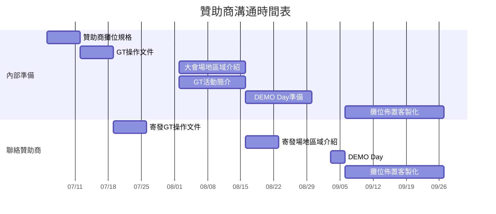

🔙 Back to [歷年 PyCon TW Organizing 共筆](/ryPr7SFyP/%2FHM5mHCFKQCu7-W5ea8ITcw%3Fview)
🔙 Back to [PyCon TW 2022 Organizing 共筆](/F4qRbwIsQXWH5B6cZ6Pzyw)

# 2022 Gather.Town Meeting Minutes

[TOC]
:::success
重要連結
- [Gather 小隊](https://hackmd.io/6W-MeHaWT6SS1rEU6L9FCw)
- [Gather 建置文件](https://hackmd.io/BOYIv7ukRoqw79QygcFbmg)
- [大會Idea Pool](https://www.figma.com/file/Olpo5OYux4zJr2I4qEKL5b/Pycon-2022-GT---Idea-pool?node-id=38%3A44) --> 可貼便利貼,發想idea
- [大會設計&動線](https://www.figma.com/file/YteSlDDVmrV5ruARhmazwZ/PyCon-APAC-2022-%E4%B8%BB%E6%9C%83%E5%A0%B4-Figma?node-id=0%3A1) --> 可做圖, 把最後呈現的圖放在這
:::
## 8/25
- To do list
    - 地圖修改
        - [ ] 宮廟往下做個示意 --> Winnie 
        - [x] 出生點 可以告知user可以向左向右走是教學 --> Nancy
        - [ ] 從車站進入 space A 車廂後會再傳送到車站 --> Ray
        - [ ] 入口錯開 - Ray
        - [ ] 放Ａ跟Ｂ在車站做標示 -> Ray
        - [ ] Open space hackmd 物件 - ben
        - [ ] Pycast宣傳: -> Ben
            - 第二季：每集一個看板（像候選人的那樣）到第三集
            - 第一季：用去年的～
        - 覺得切換Space要走好久，可以改善（？
            - 要設傳送點直接傳過去 [name=Fish]
            - 多設幾個傳送點 到傳送大廳 --> space B
            - 放四個角落
                - [ ] 物件要放？ [name=Fish]
    - 大地觸發
        - [ ] 問題簡報上都放個 可以加入 discord 的連結 - [name=Fish]
            - [ ] 加表情符號
            - [ ] 加 加入 server
        - [ ] 多幾個介紹 如何加入 discord 的投影片 --> Winnie 
        - [ ] 放在ＧＯ --> Winnie 
    - 物件擺放
        - [ ] 畫廊要放圖片 - Winnie
        - [ ] 在傳送點擺總議程表 - Winnie
        - [ ] 放徵才牆跟海報 --> ray 
        - [ ] 留言板
            - 開版 Winnie 
            - 內容 - Fish, NC 
        - [ ] 人流計數 - allen / pochun 
    - 其他
        - [x] 直接設 Coupon - Winnie
            - 設的時間: 8/25 20:00 - 9/5 00:00
        - [ ] 把文字觸發都改成英文, prompt 中文 
        - [x] 行前信加開放時間 - Fish 
        - [ ] 測 gather 密碼 - ray
    - 大地遊戲
        - [ ] Channel 文字 - Vivian
        - [ ] map 完成 - Vivian
        - [ ] 文字訊息修飾 - Winnie
        - [ ] 補上英文 channel - yoyo
        - [ ] 身份組測試 - yoyo
        - [ ] 抽獎功能enhancement - Angus
        - [ ] 下週三匯入白名單 - Angus

## 8/24
- gather 問題
    - 地圖修改
        - 宮廟往下做個示意 --> Winnie 
        - 出生點可以告知user可以向左向右走是教學 --> Nancy
        - 從車站進入 space A 車廂後會再傳送到車站 --> Ray
        - 入口錯開 - Ray
    - [x] 國泰連結 - pochun
        - 國泰金控的discord無法順利連接(大門口) (this page has been blocked by microsoft edge)
        - 國泰的t-shirt按X this page has been blocked by microsoft edge, 可能要測看看各遊覽器狀況？
    - [x] 放明星照片會不會有授權問題 -> 會再撤掉
    - 400 
        - 我好像沒這個問題... [name=Winnie ]
        - respawn魚x按下去 400
        - Rock下面的計程車x按下去 400
        - RO 海報牆x按下去 400
    - 卡人問題
        - pycon車站走中間會被擋
        - coupon 設看看
    - [x] 可以走進贊助商板板
    - 1. 覺得切換Space要走好久，可以改善（？
        - 要設傳送點直接傳過去 
        - 多設幾個傳送點 到傳送大廳 --> space B
        - 放四個角落
            - [ ] 物件要放？
    - [x] 2. 很多傳送點有點反直覺，例如進電車跟進廟的點都不精確需要學習
    - [ ] Pycast宣傳: -> Ben
        - 第二季：每集一個看板（像候選人的那樣）到第三集
        - 第一季：用去年的～
    - [x] Init 分組
    - [ ] 放Ａ跟Ｂ在車站做標示 -> Ray
    - [x] 把加入 discord 的連結用 lihi 包起來 --> pochun
    - [ ] 多幾個介紹 如何加入 discord 的投影片 --> Winnie 
    - [ ] 放在ＧＯ --> Winnie 
- from PR
    - [x] 紫色舞台 不要設牆壁
    - [ ] 大地遊戲的連結，只有公園樹下有嗎/除了 阿伯外，還有其他地方可以加入 discord 嗎？
    - [x] 大地遊戲的 discord 可以改語言嗎 --> channel 
        - [x] 測英文掛掉
    - [ ] 問題簡報上都放個 可以加入 discord 的連結 - [name=Fish]
        - [ ] 加表情符號
        - [ ] 加 加入 server
    - [ ] Space A 的火車加個柵欄，不然衝回車站會又衝回Space A - ray
    - [x] 2. space A 的 美光要往上一點（進出口比較大）
        - 往上移1~2格

- 大地進度
    - 主要：Angus 放 bot 到 GCP 上 
    - map 完成 - vivian 
    - 問題簡報 - fish
        - 加表情符號
        - 加入 server
    - 文字訊息完成
        - 修 bug
    - 身份組測試
        - 如果沒有身份組 會導到哪裡
    - 分組完加文字 - Winnie
    - 英文訊息 - yoyo
    - deadline : 8/28  
    - 抽獎：
        - 志工可以啊
        - 第二天 lightning talk 
    - 人流計數 - allen / pochun 
    - 下週三晚上匯入白名單 - Angus
    - 抽獎從大獎抽到小 最後一個是 pycon anywhere
- 最後測試：8/29 21:00 

## 8/17
- 進度確認
    - 地圖
        - [ ] 格子
            - [ ] 一般關卡的icon
        - [ ] 議程廳
        - [ ] 放映廳
        - [ ] 貓將軍
        - [ ] 徵才牆
        - [ ] 贊助大樓
        - [ ] 地圖題
        - [ ] 本土特色動物的應用
        - [ ] NPC
            - 台詞&翻譯
            - 位置
            - 圖
            - 觸發
        - [ ] 動線
            - [ ] 引導會眾路線
        - [ ] 贊助商攤位
            - [ ] 觸發物件
        - [ ] 社群攤位
            - [ ] 布條
            - [ ] 位置
        - [ ] 各國小圈圈
            - [ ] 如果可以希望能做按下去按鈕的樣式
        - [ ] tile 設置
    - 大地
        - 頻道
            - 各頻道介紹
        - 問題匯入
            - [ ] 贊助
            - [ ] 一般闖關
            - [ ] python
        - 一般闖關
            - [x] slide 圖文
            - [x] icon
        - Discord
            - 入口通道
                - 在 python server 的宣傳敘述，引導大家加入 booth game
            - 流程
                - 1. 加入 server 後, 在服務台有“start”表情可按下，進行初始化
                - 2. 第一次回答問題進行初始化
            - 初始化
                - 選擇語言
                - 問問題，分組，紅黃藍
note
- 入口
	- 贊助物件等 allen 處理國泰影片
	- 找多國語言 welcome
	- 入口維持用魚不用水鬼 - Nancy
	- sponsor 會不會太混亂？ - Nancy
		- 銀，銅各集中一個區域
	- 之後海灘不會用底圖會用物件，要調消波塊區間
	- 贊助看板要小一點，砍 2/3 到 一半
	- 多放幾個 NPC 講大地遊戲
- 主會場
	- 格子會分關卡做不同格子的面貌？
		- 物件先放旁邊，出題者自己擺
- 台味市集
	- 改名叫聊天室之類的
	- Sprint 物件有搬過來，可能可以拿來用 TN，可以整理成表格形式
	- Ben 之後會給貓將軍國泰贊助大樓
	- 部分贊助商物件不要，要拿掉
		- ichief 海報
- 大地遊戲 vivian
	- 分東南西北太難，改分食物自然人文，神秘空間地圖題
	- 在 game start 就初始化來搜集訊息
		- 請按下什麼按鈕
	- 空的頻道要補敘述
	- 贊助頻道，附上地圖
	- 按鈕可以放填表單連結
	- 頻道介紹加速
- Bot
	- 要一個初始化功能
	- 一開始進來時要填 email 或 discord ID，避免重複填
	- 問題匯入分組
- 本土特色動物
	- 融入 NPC 做特殊事情
	- 動線交給 RAY
- Event
- 其他
	- 放物件時把 人，物件對在格子上比較不會歪掉
	- [ ] 主會場加上 tile 擋掉不能走的地方 - pochun
	- [x] 主會場 贊助商 的煙火多放個簡報連結 - pochun
	- [ ] 注意贊助商攤位擺放志願 - pochun
	- [ ] 放物件 / NPC... Ray / Fish


## 8/14
- 大地遊戲
    - [問題列表](https://docs.google.com/spreadsheets/d/1fC1QJMtJ98y0k5hruDaBobHm83GyTUytgkGjA1mbLbw/edit#gid=1381314410)
    - [Github](https://github.com/BreezeWhite/pybot22)
    - [貓將軍遶境遊戲](https://www.figma.com/file/Olpo5OYux4zJr2I4qEKL5b/Pycon-2022-GT---Idea-pool?node-id=1119%3A1347)
    - 

## 8/11
- Sprint
    - 物件已全部變換新的, 感恩伯駿大大
    - guest list
    - 優惠碼兌換
    - 歡迎大家禮拜日一起來sprint大地遊戲＆地圖
- 地圖
    - 贊助商攤位大致完成, 尚未知道攤位位置 @sponsorship
        - 目前三攤有填[贊助商攤位表單](https://docs.google.com/spreadsheets/d/1hGhNEDimCwzAW4FDdSgXxowcFCcXKj7PlhKUwGnB-j4/edit?resourcekey&usp=forms_web_b#gid=697538151)
        - 贊助物件 
    - [ ] 議程廳 
    - [ ] 徵才牆 
        - 會眾貼的 - 傳單
        - 官網 - 大型佈告欄 @andy 
        - 誠徵粗工 @ben 
    - 服務台 
        - 連結PPT @admin
        - 到處放 常用資訊 hackmd
        - 物件 @ray 
    - 貓將軍 @ben 
    - 旗子 @winniepopu 
    - 個人贊助旗子 @ben 
    - [ ] ~~贊助背景~~ 大型建築物 @ben
    - 放映廳, 格子, pynight, 各國小圈圈 @shirley 
    - 入口：教學圖片, npc, 動線 @NC 
    - 轉換地：放火車 @ray @zoey
    - 優惠碼設定, 放映廳物件確認, 問題整理, 開space B @winniepopu
    - 蒐集各組連結需求, 問題整理 @pochun
- 大地遊戲
    - bot 機制大致完成
    - 頻道介紹, 地圖題, NPC 動線台詞... @TN @vivian
    - 把題目串上bot, Leader board, 分組 @yoyo
    - 抽獎, 問卷 @angus 
    - how to 分組 @Winnie


## 8/10
- Sprint !
    - https://app.gather.town/app/6NKcuFatDrrfpAgY/PyCon%20TW%20Sprint%20Venue
    - 通道：
        - 通到 sprint space
    - [ ] guest 權限
        - 名單
        - 設置時間(or 全開放？) 
    - [x] 留言板
        - [ ] 可以再加一些宣傳的東西
    - [x] 文件連結
    - [x] 大地遊戲擺設, NPC
    - [x] 專案hackmd
    - [x] 各種連結內嵌
    - [x] 小地圖
    - [ ] 稿件募集拿掉
    - [ ] 把裡面的會後問卷換成新的
- bot 需求
    - [ ] 登記聯絡方式? **信箱**
        - [ ] 一開始就寫
    - [ ] 分組 - Winnie
        - [ ] 心理測驗
        - [ ] _________? 貓/狗 --> 會場佈置有關
        - [ ] 時機點
            - [ ] 按表情
            - [x] 一開始
        - [ ] command 幫兩隊加幾分
        - [ ] lihi 短連結算人流次數
    - [ ] 星星越多 抽獎權重越高？ - @Angus 
        - 抽獎功能
        - 權重越高
        - 輸出抽獎人名單
    - 抬轎靈氣 
- 再修改
    - space A 車站 來回太近 
- To Do list

入口：
- [ ] NPC
- [x] 贊助商背板
- [ ] 教學
- [ ] 魚兒進階教學
- [ ] Tile
- [ ] 動線
- [ ] 大型的pycon apac 2022

轉換入口：
- [x] Tile
- [ ] 各space 位置
    - [ ] pynight: A
    - [ ] sprint 另一個空間
    - [ ] 轉換入口在兩個space都有
- [x] 動線
- [ ] 包裝台詞
- [ ] 特色動物NPC擺放位置

Sprint:
- [x] 英文翻譯
- [ ] 中文詞放note
- [x] 專案文件 hackmd
- [x] 留言板
- [ ] Discord頻道
    - [ ] tag 坤賢
- [ ] 地圖權限 
- [ ] 優惠碼
    - 8/14 7:00 - 8/15 7:00

主會場：
- [ ] 格子
- [ ] 議程廳
- [x] 書香區
- [ ] 藝廊
- [x] 宮廟
- [ ] 景觀icon
    - [ ] Ray / Fish: admin/event
- [ ] 命運卡片
- [ ] 各國小圈圈
- [ ] Pynight 市集 - shirley
    - [ ] 把空間界線做明顯一點 Deadline: ___
- [ ] 動線

大地遊戲：
- [ ] 頻道介紹
- [ ] 贊助商介紹
- [x] 大地包裝
    - 貓將軍出巡繞境
    - 到處走 看到各地景色 小吃
    - 吸收靈氣
- [ ] Npc
- [ ] 地圖題
    - [ ] 熊找木瓜牛奶
    - [ ] 找不同的那條街
- [x] 景觀icon
- [x] slide template
    - [ ] 請 evnt 幫忙

Space:
- [ ] 權限
- [ ] 優惠碼測試
- [ ] 傳送點 出生點
- [ ] Room連結

禮拜天sprint
- 會場/大地sprint：一起來sprint吧
- 八米共同空間

元素
- 麻將

臨時動議：
- 選擇題加付多少錢的說明
## 8/5
- 地圖
    - 贊助
        - 書香專區放台味市集
        - Sprint 優惠碼計次 可用五次
        - 人流
            - 周邊物件轉 lihi
            - 徵才牆
            - 有連結的 embedded 都用 lihi (成本有點高) -> pochun
        - 徵才牆 
            - 表單 -> sponsor 
        - 人流計數器 --> Allen
            - 看得到 -> promote 
            - 看不到
        - 背板放
            - 入口兩邊
            - 會場草地
        - 各贊助商大地的填答率
            - 紀錄起來
- 大地 - Vivian & TN 
    - 故事包裝 --> TN （急）@8/7 
        - 會眾的角色
    - 動線＆介紹
        - NPC台詞 Vivian / TN  
        - 各頻道介紹歡迎詞 Vivian / TN
        - deadline: 8/17
    - 地圖題 
        - Vivian / TN
## 8/3
### 地圖

### 大地
- 頻道
    - Vivian 會再補頻道說明
    - [大地規劃](https://hackmd.io/3Iu3dcX3Q6uoURsUSC_mqg?both)
     - [題目](https://docs.google.com/spreadsheets/d/1fC1QJMtJ98y0k5hruDaBobHm83GyTUytgkGjA1mbLbw/edit#gid=276195201)
        - [景觀題詳細描述](https://docs.google.com/document/d/1yT7APvgE8pgnpjK4A1AiF6vwWYRcAwXuPEMzJchw3Gs/edit)
- Bot
    - Python 題目：
        - 題號
        - 題目 Title
        - Acceptance
        - Difficulty
    - 問卷題
    - python 題目人數更新
        - yoyo: 動態顯示
    - 幫題目想 Title - pochun
    - 想格子 - winnie
    - 把 bot 放上來
        - pull request 到 yoyo 的 code
        - 由 yoyo pull 下來
    - GCP, mysql 的部分
        - Angus: 跟Matt對接？ 
    - 問卷題隨機題
        - Angus
- To do List
    - Webhook for 大地遊戲 - Winnie
    - 頻道說明 - Vivian
    - 選項文字 - Vivian
    - bot 放到主 server - Angus
    - GCP, mysql - 
    - python 題目/leader board 格子外觀
    - 問卷題蒐集
    - 題目
    - python 題 title/difficulty/金幣數 (pochun)
- 設定
    - 可進來空間的時間： @行前信 
        - 9/3 8:30 開放
## 7/28
:::info
- **Location:** Home
- **Link**: https://app.gather.town/app/saNwgWeuvCTkR2Lx/pycontest
- **Date:** Jul 28, 2022 (TST)
- **Participants:** 
    - Winnie
- **Minutes Taker:**
:::

- 地圖
    - [正式大會場地 Space A](https://app.gather.town/app/nGOG11wkRybqeJff/PyCon%20APAC%202022%20-%20Space%20A)
    - 禮拜二與贊助組討論需修改一下動線與贊助商攤位
    - PyNight 另外開 @dongking1615 
    - 場地進度：
        - 入口, 迎賓大廳（轉換地）已大致完成
            - 教學會放在迎賓大廳[name=po-chun]
            - 觸發NPC
        - 主會場：
            - 大型建築物大致完成, 動線調整中
        - 地板：今天會再設計組討論
    - TBD:
        - 大富翁格子需觸發的 ICON
        - 各場地需要的物件, 人, 幫忙找素材, 
        - 動線引導
    - 入口：
        - 贊助商背板放左右兩邊
        - 會場地圖, 會場介紹 ?
    - 轉換地
        - Zoey 火車頭
        - 車站放中間
        - 大樹放下面一點
    - 主會場：
        - 放一個小舞台在主舞台上
        - private space 畫寬一點
        - 贊助商攤位可以先改 logo 
        - 大富翁格子先做～ @dongking1615 
        - Pynight @dongking1615 
        - 個人贊助 放招牌大樓 
        - 宮廟 預設場地加貓將軍
    - TBD
        - Ben : 
            - 白金贊助攤位
            - 議程廳拓寬
            - 大富翁格子
            - 藝廊
            - 貓將軍
        - Zoey
            - 火車頭
            - 加英文字在車站招牌上
        - Shirley 
            - 大富翁格子
            - Pynight
        - Winnie
            - 贊助商建築物
            - icon
            - 宮廟room
        - Ray
            - 做月台or人行道通道四個入口
            - 車站放中間
            - 大樹放下面
- 大地
    - [加入Discord Server](https://discord.gg/7n7kGrSk) 確定架構
    - 題目持續提供中
        - [題目](https://docs.google.com/spreadsheets/d/1fC1QJMtJ98y0k5hruDaBobHm83GyTUytgkGjA1mbLbw/edit#gid=276195201)
        - [景觀題詳細描述](https://docs.google.com/document/d/1yT7APvgE8pgnpjK4A1AiF6vwWYRcAwXuPEMzJchw3Gs/edit)
    - 進度
        - 架構確定
        - [x] 填空題
        - [ ] 選擇題
        - [ ] Leader Board
    - TBD
        - 備用 server ?
- Spint 場地
    - 把物件
    - 物件資訊放在行前給坤賢介紹一下?
        - hackmd 時程表
        - 專案介紹 
        - 白板 (提醒前面的訊息)
        - Idea Pool
    - 車廂名字要記得改
## 7/27
:::info
- **Location:** Home
- **Link**: https://app.gather.town/app/saNwgWeuvCTkR2Lx/pycontest
- **Date:** Jul 27, 2022 (TST)
- **Participants:** 
    - Winnie
- **Minutes Taker:**
:::
- 正式大會場地：https://app.gather.town/app/nGOG11wkRybqeJff/PyCon%20APAC%202022%20-%20Space%20A
- 贊助商
    - 讓白金變 fancy
- 地圖
    - 入口有拓寬了
    - Ben : 消波塊, 最好可以放個人在消波塊裡
- 大地遊戲
    - [題目](https://docs.google.com/spreadsheets/d/1fC1QJMtJ98y0k5hruDaBobHm83GyTUytgkGjA1mbLbw/edit#gid=276195201)
    - [景觀題詳細描述](https://docs.google.com/document/d/1yT7APvgE8pgnpjK4A1AiF6vwWYRcAwXuPEMzJchw3Gs/edit)
    - 翻譯 @translation @pochun
    - Vivian: 
        - 小遊戲的答案
            - 只能在gather上看？
        - To Do List:
            - 各類型題目一題範例題
            - channel 文字介紹(中文)
            - 地圖題
            - 開頻道
            - 標號
            - 
    - Discord bot:
        - 問答題不見：）
        - Angus:
            - Leader board
        - Yoyo
            - 選擇題, 問答題
            - 金幣, 積分
            - Lobby：
                - 發圖片
            - 中英文分開
                - 第一次bot問的時候 問語系

## 7/25
- Discord 頻道
    - 贊助商
    - gather 旅遊
        - 東 南 西 北區
        - 食物 人文
    - gather 地圖闖關
    - Python 程式挑戰
    - 宮廟？
        - 求籤？
    - 大廳 Lobby
    - 服務台 help?
        - 有多少金幣, 問地圖

### 頻道說明
    - help
        - 遊戲說明（去哪可以賺多少、多少可以抽獎）
        - 遊戲方式（怎麼用 discord）
        - 地圖
        - 分數查詢

    類別 - 贊助攤位
    - 贊助一
        - ⭐answer⭐
        - 官網：我們的官網
        - 介紹：
    - 贊助二
        - 回答問題拿星星 & 高額金幣，請點 ⭐
            > 私訊：請到gt贊助攤位查看題目，並於下方輸入文字答案
            > 您將獲得$xx
            > 查看位置：map link
        - 查看簡介，請點 (導至官網頁面)
        - 查看 xx，請點：

    類別 - 台灣
    - 北
        - 建築
            > 請到 xx 看選項
            > 台北最高樓？
            > --下拉式選單ABC--
            > 一次答對會比較多錢
            > 查看位置：map link
        - 建築
        - 山
        - 湖泊
        - 美食
        - 人文
        - 基隆
        - 台北
        - hashtag 台北夜景
    - 中
        - 建築
        - 美食
        - 山
        - 湖泊
        - 美食
        - 人文
    - 南
    - 東
    - 美食

- 題目
    - [問題總表](https://docs.google.com/spreadsheets/d/1fC1QJMtJ98y0k5hruDaBobHm83GyTUytgkGjA1mbLbw/edit?usp=sharing)
    - [題目](https://docs.google.com/document/d/1yT7APvgE8pgnpjK4A1AiF6vwWYRcAwXuPEMzJchw3Gs/edit)
- 贊助商問題 * 12
    - DC
        - 請到 XX 贊助攤位看題目
        - [開始回答]文字回答
        - 提示：img地圖 物件照片或是文字提示 看官網（!cmd）
        - 贊助channel
        - 表情符號：回答問題 & 我們官網
    - Gather
        - 題目在gather
        - 顯示：題目用slide 或 圖片(無法放連結)？
        - 官網 link:
            - [ ] 12 個物件 都一樣link
            - [ ] 還是放slide裏？
- 旅遊問題 * 10
    > 食物問題 * 3
    > 動植物
    > 人文
    > 地方特產
    > 建築
    > 自然景點
    - DC
        - hashtag 放在 channel 敘述 ＋ 表情符號
        - 用表情符號觸發
        - 直接看得到題目
        - 下拉式選單(A, B, C, D)
    - Gather 
        - 題目, 景點介紹會在 slide 第一頁
        - 在格子裡放 icon 觸發題目
        - 題目跟敘述 做在同一頁 slide
        - slide最下面: 附 discord channel & hashtag
    - Ex:
        - Channel: 北部
        - 敘述： 1. #台灣最高樓 - :cityscape:
        - 表情符號： :cityscape:
        - 私訊bot跳出來 出現題目
        - 下拉式選單回答
> 參考資料
    [台灣多媒體開放資料](https://media.taiwan.net.tw/)
    [政府資料開放授權條款](https://data.gov.tw/license)
    [台灣旅遊情報網](https://www.taiwan.net.tw/)
    [台灣景點照片](http://www.blue-design.url.tw/download-pic.htm)
    [全台「十大自然地景」](https://udn.com/news/story/120665/4490978)
    [台灣文青廟宇大集合](https://imreadygo.com/61516/?utm_source=udn&utm_medium=&utm_campaign=61516_20200414)
    https://playing.ltn.com.tw/article/10084/1

> 請問台灣最高樓?
> 
>  
> 
> \- 位於臺灣臺北市信義區
> \- 樓高509公尺（1,670英尺），地上101層、地下5層
> \- 曾於2004年12月1日至2010年1月7日間擁有世界第一高樓的紀錄
> \- 目前為世界第十一高樓以及世界最高的綠建築（LEED EBOM）
> \- 大樓內擁有全球第二大、全球唯二開放給遊客觀賞的巨型阻尼器
> \- 標高509公尺的101樓上方之觀景台為全球最高的戶外屋頂觀景步道
> 
> A. 101
> B. 故宮
> C. 日月潭
> 
> discord channel：北部 (link)
> vote：:cityscape: #台灣最高樓
> (need help please click)
- 程式 * 10
    - follow 景觀題
    - Gather
        - 物件：請去 XX channel 接受挑戰！？
        - 有一兩個物件引導
    - DC
        - 一個頻道for程式？
        - 如何包裝
        - 直接知道題目 
        - 
- 地圖 * 3

    - 場地特殊關卡, 在關卡結束後放通關密語, 輸入 disocrd, 即可獲得金幣
    - 提示的格子會延伸出一條腳印指引到遊戲區入口

    > 
    > 
    > 恭喜通關！
    > 通關密語：通關我超棒
    > 
    > discord channel：神秘空間
    > vote：

    > 街道找不同 (或辦桌找不同)
    > 用街景做背景，有三條街，其中一條的某一個商店長的跟其他不一樣，走進去通關

    > 幫 npc 找食物，進入遊戲區之前有一隻熊說他想喝木瓜牛奶，在遊戲區內找到飲料店 -> 找到木瓜牛奶通關

    > 廟宇相關? 夜市? 便利商店?
- 問卷 * 3
    - 毫無意見
- 可在 gather 放台灣風景站牌，連到各區的官方觀光 ig 裡面有風景照~


## 7/19 大地遊戲互動Demo 
:::info
- **Location:** Home
- **Link**: https://app.gather.town/app/saNwgWeuvCTkR2Lx/pycontest
- **Date:** Jul 19, 2022 (TST)
- **Participants:** 
    - Winnie
    - Fish
    - Pochun
    - Angus
    - Yoyo
    - Yider
    - Vivian
    - Nancy
    - Allen
    - Andrian
    - Wei
- **Minutes Taker:**
:::
- 贊助商互動 demo
    - 文字互動 - yoyo
    - 表情互動 - angus
- 建議
    - gather 引導到discord
        1. link
        2. 可以用文字顯示, 切換channel
    - 內嵌discord 的活動（但不能計入大地遊戲積分）
- 注意事項
    - 可以詳細說一下什麼表情符號代表什麼
    - 回答問題時統一用下拉式選單，不要用表情符號
    - 表情符號點完可消失
    - 遊戲頻道設定不要讓人輸入訊息
    - 是否能重複回答題目
        - [ ] 方案一：只能回答一次
        - [x] 方案二：答錯，再給兩次機會？錢少：答到對為止 -> 可以一直回答
    - 不限時回答
    - 重複答題，會出事嗎
        - 不會出事
        - 答對後可以把他disabled
    - gather 互動介面改善 @p6rYrbjoTOykVnUqRCl-Ag 
    - 規劃：
        - 贊助攤位用文字 (#加上特殊符號)
        - 其他用下拉式選單
        - channel
            - vivian https://hackmd.io/V835qNe-QBKv9Gs3KDpqEw?view
            - 選項選題 & hashtag
        - leader board
            - 以金幣數排名（不考慮星星）
            - 累計金幣跟星星的規則
            - 機制
                - 答對給星星, 金幣
                - 星星：贊助商抽獎
                - 金幣：排名前面的可以直接獲得 PyCon APAC 2022 提供的獎勵
            - 在 ==Python Taiwan== server 更新 
        - 知道自己多有多少星星&金幣
            1. 答對後直接秀
                - 這次獲得多少星星 or 金幣
                - 總共獲得多少星星 & 金幣 
            2. **#路人甲**按選項獲得資訊（⭐️、💰）（或叫 **#志工** ？）
    - 贊助商題目出題
        - 7/31
        - 填空題：文字題！
        - 題目：中英文
        - 答案：中文 or 英文都接受
- 分工
    - [name=Angus] 下拉選單、**#路人甲**按 🗺 傳地圖
    - [name=YoYo] leader board、打指令取得金幣星星數、求籤 (optional)
    - [name=Vivian] 蒐集並整理問題、規劃頻道
    - [name=Winnie] 開 Discord Server

### Gather 小隊進度規劃
- 7/24 物件清單列完 開始蒐集各組連結需求 開space
- 7/31 蒐集完所有大地題目 完成大部分地圖底圖(主會場&入口&轉換) 
- 8/7  完成所有物件擺放
- 8/14 完成物件連結與內嵌 
- 8/21 所有地圖完成 內部測試 & 開箱日, 壓力測試
- 8/28 開權限
- 8月底 demo day
 
每週三開個會 20:00
@NC @shirley

7/23(六) 晚上八點 cowork
- vivian
- winnie
- yoyo
- angus

### Discord 規劃
- 需求： Vivian
- 資料結構, 程式架構規劃&分工:
- Deadline: 7/26
## 7/14
- 地圖
    - 議程聽
        - @ben 畫出剩下的餐廳
    - 動線
        - 主會場 正方形格子
        - 大富翁 @Shirley @ben
    - Sprint
        - 19個房間 (南投-->彩蛋)
        - 伯駿 負責指引的部分
- 贊助攤位
    - 表單確認 @andy
        - https://docs.google.com/forms/d/e/1FAIpQLSdGFB8xQS2NgKV24plRQwUjlsBiKQc2_a7Cmf1e-LcmkJskLw/formResponse
        - 提供英文說明
        - 提供日：禮拜日前
        - 表單截止日：8/17
    - 常規攤位會需要 13 個（其中包含兩個白金是兩邊都有、九個銀級只能選一邊），外加一個 Packt 的書香專區(?)
    - 洽談中但也是會附一個攤位的贊助商：天瓏、PSF（高機率會有，所以應該可以先規劃進去）
    - 攤位的部分，我們也希望有簡略的地圖，可以讓贊助商選自己想要的攤位位置
- 大地遊戲
    - NPC 放哪些
    - 車站會有NPC
    - 把贊助商的格子做的顯眼一點點 指引到贊助商攤位
        - 超級星星格 
        - @ben @shirley
- 工具分享
    - https://www.imgonline.com.ua/eng/8bit-picture.php
    - https://img8bit.com/

- for Ben
    - 十三個贊助商要怎麼擺
        - 提供攤位示意圖
    - NPC 可以放到主視覺地圖裡，思考可以如何使用

- 


## 7/11 入口討論
- 入口
    - 風格：大海銜接陸地
    - 教學的NPC 跟指示
        - venue_admin 已經完成指引文件
        - @team_venue_admin @yider
        - 可以找他們幫忙 出圖, 做翻譯
        - 中英文道路
- 迎賓大廳
    - 風格：
        - 做成隧道
        - 或是迷霧森林 
    - 介紹大地遊戲, 簡單指示
- 轉換場地
    - 四個入口：
        - 主會場1 , 主會場2, pynight, sprint
    - 風格：
        - TBD
- To do:
    - 加寬 入口
    - 尋求夥伴幫忙指示
    - 先做四個轉換入口
    - Deadline: 7/21 會有個簡單版的轉換入口
- Pochun
    - 物件需求清單
    - 入口動線安排
        - 小黃人, 小紅人
    - Sprint 場地
        - https://app.gather.town/app/6NKcuFatDrrfpAgY/PyCon%20TW%20Sprint%20Venue
        - 會沿用
        - 目前有 2 個專案
        - 英文為主
        - 轉換場地為英文使用
## 7/5 大地遊戲觸發流程討論
:::info
- **Location:** Home
- **Link**: https://app.gather.town/app/saNwgWeuvCTkR2Lx/pycontest
- **Date:** Jul 5, 2022 (TST)
- **Participants:** 
- **Minutes Taker:**
:::
- [會眾大地旅程](https://hackmd.io/BOYIv7ukRoqw79QygcFbmg#%E5%A4%A7%E5%9C%B0%E9%81%8A%E6%88%B2)
    - 題目分批開放回答
    - Gather town小遊戲：
        - 3題左右
        - 觸發位置再議
    - 獎品數量努力爭取一下
- [關卡題目 Idea](https://hackmd.io/aHxwEGLhQM-ToLwzlwBOgQ)
```
BY Angus
## 主廟：(神明/籤筒bot)
關卡提示選項   =》 Bot 訊息
1. 求事業  =》 請到XX攤位，有高薪職位等著你
2. 求姻緣  =》最欣賞的Talker ，可到xx Talk Room （random or 相關），可以遇到好姻緣
3. 求財富  =》XX 攤位有機會獲得高額金幣
4. 求健康  =》到XX 景點 走走，可能有意想不到的驚喜
      (XX) 可Random 產生

5. 點光明燈 =》寫下希望Pycon 改進的地方，或任何讚美及建議，個人心願抒發也行 （ 超過20字給1金幣）

## 景點NPC: (問券/閒聊 Bot)
關卡提示：1. 閒聊得金幣 2. 知識換金幣 3. 尋寶  4. FAQ
1. 閒聊：NPC  詢問特定 問券問題（選擇題），會眾回答得金幣1枚
    - 如何得知 Pycon 訊息..
    - 參加動機
    - Python 年資
    - …
2. 知識換金幣：知識王 lite, 景點或python 相關知識
3. 尋寶 ： 指引到可獲得 星星與金幣的地方
4. FAQ:  一般常問指引訊息

## 贊助商攤位 NPC: (贊助 bot)
關卡提示：依關卡設計

- 特殊機制：提供管理者1個command, 能在指定的時間內將星星與金幣翻倍 ex. /reward channel 14:00 30min x2

## Pycon/PyCast 攤位：（pycast bot)
Pycast 需求
————
## 互動方式：
1. 不同關卡以不同的Text Channel 連結進入
2. User (會眾）進入Channel 會看到關卡遊戲指引，並只能點選特定選項-以(自訂)表情符號emoji 代表，限制發訊息的權限
3. 依Channel 及User所選的選項，Bot 主動DM 給User, 開始進行問答

REF: https://stackoverflow.com/questions/68659858/how-do-i-dm-a-user-when-a-reaction-is-added-to-a-message

不同互動功能需求的Bot 可以用不同的bot 來跑，或是用同一隻bot, 依channel 及選項決定互動方式，主要的差別在於一開始的互動，之後的問答邏輯與積分計算與資料庫Access 是一制的
———
```
- 互動方式 & 觸發流程確認
    - 提案一 @Angus 
        1. 不同關卡以不同的Text Channel 連結進入
        2. User (會眾）進入Channel 會看到關卡遊戲指引，並只能點選特定選項-以(自訂)表情符號emoji 代表，限制發訊息的權限
        3. 依Channel 及User所選的選項，Bot 主動DM 給User, 開始進行問答
    - 提案二 
        1. 到攤位看問題
        2. 跟bot私聊輸入 $answer
        3. 回覆下拉式選單讓使用者選擇要回答的關卡代號
        4. 使用者選擇後跳出輸入框框，然後輸入完整的答案句子 ( or 選項)
- Discord bot 提供的 feature
    - 選擇英文/中文語系 --> 先做中文
    - 查詢 leader board
    - 回答問題
- TODO
    - 兩種進入問題（Discord）的方式個做一個簡易的版本做一下功能驗證，看看要哪個方式 -> 先以 Angus 提案為方向做一版做驗證
    - 詢問一下網站組 Server 放在哪？我們可以用嗎？
    - [name=Vivian] 可以在 Discord 放一個可以看地圖的功能
    - @yoyo @angus 驗證流程
    - @vivian 把步驟流程記一下！
    - 關卡 channel 分地區？
- 驗證 Demo
    - server 先分開建, 之後再說
    - @yoyo
        - 先做贊助商
    - @angus
        - 先做宮廟題目
        - 所有 NPC 共用一個 channel
    - Deadline
        - 7/19 (二) 20:00
        - 邀請其他人一起來測試 @venue @sponsorship
## 6/30 地圖
:::info
- **Location:** Home
- **Link**: https://app.gather.town/app/saNwgWeuvCTkR2Lx/pycontest
- **Date:** June 28, 2022 (TST)
- **Participants:** 
- **Minutes Taker:**
:::
- 地圖
    - 已放置部分設計物件上去場地
        - 主舞台完成
        - 議程廳
            - 不同的店家
            - 每個空間有三個獨立空間
            - 海產店, 薑母鴨, 羊肉爐...（農場？
        - 贊助商 (國術館, 早餐店)
            - 每個區塊都可以自由搭配
            - 讓贊助商自己選？
            - 早餐店阿姨 + 外面一群人吃早餐
            - 招牌可以客製
            - 房地產廣告, 選舉布條, 招牌
        - 各國交流區
            - 可以不用執著在美食街
        - 選擇
            - 商家種類
            - 建築物
            - 招牌客製
        - 出示意圖
        - 開表單？
        - 可以在開箱日來做這件事(8月)
    - 功能性區塊確認
    - 物件提案
        - 都可以跟 Ben 說
    - 平台統一
        - Figma 
        - Gather town 
            - New name: PyCon APAC 2022
            - 正式空間
            - 要不要用 pycon 帳號？
            - 用 venue 帳號開
- Todo
    - 來開正式的pycon apac space吧 - Winnie
    - Discord 大地遊戲頻道

## 6/28 大地遊戲
:::info
- **Location:** Home
- **Link**: https://app.gather.town/app/saNwgWeuvCTkR2Lx/pycontest
- **Date:** June 28, 2022 (TST)
- **Participants:** 
- **Minutes Taker:**
:::
#### 贊助需求：
    - demo day
    - 物件
    - 數據追蹤 計量器
    - 攤位大小
- 會眾大地旅程 [name=Winnie]
    - 故事
        - 遊走大富翁格子，可獲得意外獎勵(星星&金幣)
            - 一般關卡(獲得金幣) 
            - 贊助關卡(獲得星星 & 高額金幣)
    - 規則
        - 目的：蒐集星星 & 錢幣
        - 1. 蒐集五顆星星（贊助商）**即可擁有抽獎資格**
        - 2. 最多錢幣者：前 20 名 有特殊獎勵
        - **贊助商攤位關卡會同時發放高額金幣與星星**(可透過廟口物件誘導)
    - 開始 & 誘導
        - 從 discord channel 看到訊息公告
        - 在地圖上看到某些指引
            - **廟口**放贊助商攤位相關引導
            - 接觸格子
                - 破一般景點關卡 & 贊助關卡
                - 透過格子去贊助商附近接觸互動物件破任務
        - 贊助商攤位撒花
        - 贊助攤位限時搶金幣活動
    - 闖關
        - 一般關卡
            - 到格子上玩小遊戲或回答問題
        - 贊助關卡
            - 透過格子上的提示去贊助商攤位完成關卡
            - 會中如果融會貫通了解眉角 就會自己去贊助商攤位到處走走
            - 我們也會放幾個NPC 暗示贊助商附近很"多金"
    - 題目
        - 台灣景觀、人文題 --> 觸發景點介紹？
        - Python 相關題目
        - PyCon 宣傳題目
        - .......
    - 回答問題
        - discord 文字題
            - 到 discord 上打關鍵字觸發題目
            - 文字或選項回答問題
        - gather 小遊戲題
            - 場地特殊關卡, 在關卡結束後放通關密語, 輸入 disocrd, 即可獲得金幣
    - 其他
        - 機會與命運？
            - 到 bot 上輸入 !chance 隨機獲得&失去金幣
            - 最多輸入三次(?)
        - 人流計數器
            - 紅白大對抗
            - 放贊助商附近？
            - 贏隊統一加 ＿＿ 金幣？？？
    - Leader Board
        - 在 discord channel 上定時更新排名（金幣）
        - github page 呈現 ？
        - 內嵌物件
    - 兑獎
        - 金幣最高前20名有獎勵
        - 只要集滿五個星星即可抽獎資格
    - ToDo
        - 題目數量
        - 題目設計
        - 景點統整（9:00 與活動討論）
        - Discord bot
            - 可存每個人的金幣和星星數目
            - Learder board
            - 應付回答問題
            - 抽獎？？或是匯出符合資格資料給 Day2主持人

====================================
- 大地遊戲
    - 贊助商遊戲
        - 取消搜集題目
        - 推廣贊助商機制：
            - discord channel 
            - 在 贊助商攤位 推廣
            - 贊助商攤位可能會比較多 bonus
            - 會不會分掉 贊助商的流量？
            - discord bot
                - 限時加分
                - 撒花加分
            - [ ] 推播管道 gather / discord --> 人工, 蒐集贊助商推播資料
            - 額外設計遊戲導引到贊助商攤位上
                - 跟贊助商有更多互動
                - 放贊助商周圍
                - 間接使贊助商流量變高 --> 人流物件
            - 人流計數器 --> 結合紅白大對抗
    - 贊助商攤位
        - 靜態
        - 工作人員駐守
        - 影片, 物件內嵌
    - 機制
        - 闖關制
            - 破比較多關, 發票拿比較多, 機會比較多
            - 關卡：贊助商攤位 & 景點關卡
            - 摸彩券：贊助商越高等, 彩券越多
        - 鼓勵機制
            - 拿到 ___ 張發票才能抽獎？
            - 每破完 5 關多一張發票？多一個抽獎機會？
        - 兌獎機制 @angus
            - [x] 摸彩券, 用權重去算 
            - [ ] 抽號碼？ 摸彩摸發票？
            - [ ] 只告訴他有無中獎 不告知原因
            - [ ] day 2 抽獎環節
        - 推播
            - focus 在贊助商遊戲
    - 大富翁環島遊戲
        - 搜集題目
        - 吸引：
            - 推薦遊玩順序
        - 格式可以照台灣景點順序
        - 格子會對應到臺灣景點 (臺北101、日月潭...)，可加上景點介紹
        - 在 gather 上旅遊，並在 discord 輸入走過的景點
        - 題目：
            - 在 discord 上回答問題, 景點相關問題
            - 之前發想的小遊戲 --> 彩券？？
        - 獲勝條件：造訪 5 個景點 (可由我們指定)
        - 獎勵？？
    - Idea
        1. 類似Pokémon go，玩家可隨意在地圖走動
        2. 景點與贊助攤位為PoI設立discord, 可依PoI 設定題目及獎勵（發票？），並可獲得XP 值積分，積分到一個特點值可Level up (optional)
           - 到了就可以有經驗值，破關之後再獲得更多積分
        3. 可利用廣播撒花（Bonus) 訊息引導玩家到各PoI, Bonus 有數量限制，先到先得（ref: giveaway bot)
           - 搶獎勵
           - 做贊助商額外bonus? 白金優惠？
           - 有 釘選 跟 公告 訊息
        4. Leader Board : 可看到目前自己的積分排名 （利用 discord announcement or gather ?)
            - 排行榜
                - [x] discord channel --> yoyo
                - [ ] Github Page :) 
                    - 可能 delay
                - [ ] 一頁式網頁
            - discord -> bot 更新
            - 我們會有 discord channel
            - 物件去內嵌 
        5. 最終可以所獲得的獎勵及積分，進行頒獎與抽獎 （規則可再定)
            - 給前幾名獎勵
        6. Marketing & Data Collection:  可在各PoI 置入行銷訊息（撒花頻率及數量可以贊助等級設定）及利用題目來達到問券的收集（因之前的問券回收率似乎不高），Data Team 可紀錄遊戲Bot 收集的data，進行統計 
            - 把想搜集的資料包裝成大地遊戲的題目
            - 參雜一些問卷的題目
    - 贊助商繳交題目期限
        - 8/10（三）
    - 進度
        - bot 可以選語系
        - bot 可以回答問題 的 大概
        - 
    - 時程安排
        - ７月底 希望贊助遊戲可以測試
        - 壓力測試
            - 8/21 月會
            - Deadline : 
        - 備案？
            - [x] google 表單
                - 可以做分數
                - [ ] 產生 發票號碼 ？
                - [x] 填自己的資料參加抽獎
            - [ ] gather town 本身


## 6/16 進度會議
:::info
- **Location:** Home
- **Link**: https://app.gather.town/app/saNwgWeuvCTkR2Lx/pycontest
- **Date:** June 8, 2022 (TST)
- **Participants:** 
- **Minutes Taker:**
:::
- 地圖：
    - 先確定個區塊位置跟大小
        - 加白邊
    - 需求物件確認
        - 每個場次會有2-3個人 在同一個 議程廳 
        - 同時會有四個議程廳
        - 給每個講者獨立Q&A時段
        - 一個大議程廳 至少有三個 private space
    - 繪製地圖地板
- 大地遊戲：
    - [Idea Pool - 大富翁環島](https://www.figma.com/file/Olpo5OYux4zJr2I4qEKL5b/Pycon-2022-GT---Idea-pool?node-id=765%3A703)
    - 贊助商題目規格確認
    - 遊戲流程
    - 開設大地遊戲頻道
- Discord @yoyo
    - 完成會眾自行選擇中英文回答問題
- Sprint @yoyo @alison
    - 200人, 20間
    - 增設車廂
    - 多10個空車廂？ --> 命名？
    - 入口改個路線, 方式
    - 更改車廂命名方式
    - 想一下新包裝
- To Do
    - 贊助商動線
        - 去年邀請贊助商來逛場地，讓他們按照級別優先順序自己選
    - 增加互動：會眾語系
        - ID 前綴
        - 問註冊組有沒有統計地區 --> 有統計 “國家” 
        - 語系識別 怎麼做？ --> 
        - 分眾：
            - 主題
            - 語系
            - .....
        - 志工標註可以講什麼語言
        - 前綴講者
---
## 6/8 大地遊戲討論
:::info
- **Location:** Home
- **Link**: https://app.gather.town/app/saNwgWeuvCTkR2Lx/pycontest
- **Date:** June 8, 2022 (TST)
- **Participants:** 
- **Minutes Taker:**
:::
- [Idea Pool - 大富翁環島](https://www.figma.com/file/Olpo5OYux4zJr2I4qEKL5b/Pycon-2022-GT---Idea-pool?node-id=765%3A703)
- 贊助商題目規格確認
- 遊戲流程
- 開設大地遊戲頻道


## 6/2 進度會議
:::info
- **Location:** Home
- **Link**: https://app.gather.town/app/saNwgWeuvCTkR2Lx/pycontest
- **Date:** June 2, 2022 (TST)
- **Participants:** Vivian, Ray, Winnie, Ben, Zoey, 9, Andy, yoyo, shirley
- **Minutes Taker:**
:::
- 進度確認
    - 設計
        - 特有種動物
            - 會討論有沒有要統一風格
        - 貓將軍草稿
    - 場務
        - 地圖地板格子
            - 在四周的橘色格子可能要再放大一點
            - 等其他物件齊一點，在決定格子顏色
        - 入口處規劃小紅人NPC介紹路線
        - 賽車要在特定的 work space 才能開
            - 現在應該不限 space type 都能用了 [source](https://withjulio.com/gather-town-tutorial/you-need-to-know-this-before-you-make-gather-town-go-kart/)
        - [開 gather](https://app.gather.town/app/saNwgWeuvCTkR2Lx/pycontest) 
    - 大地遊戲流程
        - 在廟中遺落多個籤詩
        - 每個籤詩對應到大富翁的某個格子（可能會放地標icon在格子上，籤詩對應地名）
            - 廟中住持拿著佛經，找住持可看提示 ex: 台灣十大傳說地標位置
        - 走到特定的格子上會觸發格子顯示問題（與贊助商有關的問題）
        - 到贊助商攤位上尋找答案
        - 到 discord / 特製網頁回答問題
            - 選擇題有點太簡單，怕他們隨便按，可能會讓他們輸入文字
        - 每完成一題得到一個發票號碼
        - 最後兌獎
        
- 新東西新發現
    - [Gather wiki](https://gathertown.fandom.com/wiki/Guides#Mapmaker_Guides_(External))
    - [tiled 工具](https://www.mapeditor.org/)
    - tile resource: 
        - [opengameart](https://opengameart.org/art-search-advanced?field_art_tags_tid=tileset&sort_by=totalcount)
        - [itch.io](https://itch.io/c/1904339/gathertown-compatible-32x32-tilesets)
    - embedded games: https://wheelofnames.com/
    - gather town discord: https://discord.gg/jVBme3cS

## 5/28 大地遊戲
:::info
- **Location:** Home
- **Link**: https://meet.google.com/wdd-kvyq-rta
- **Date:** May 28, 2022 (TST)
- **Participants:** Vivian, Ray, lee wei, connie, gobby, togi
- **Minutes Taker:**
:::

- 遊戲方案介紹
    1. 籤詩
        * 使用者走到廟 -> 傳送到贊助商 -> 贊助商給正確的密碼 -> 傳送回原點 -> 取得籤詩
        * 人/物件互動？
            * 跟人互動拿到更多籤詩？
        * 想法
            * 跟台灣地標有關
            * 單純的籤詩跟遊戲無關
            * bonus 
            * 中文？英文版？ --> 讓大家都可以參與
            * 不用侷限
                * Py廟開答：“”
    2. 發票?
        - 每個這樣的點，隨機取得一組號碼 -> 找 Infra Team?
    3. 分紅白兩隊
        - 設計一個難以抵達的點，達到就有200 分
        - like [ingress](https://ingress.com/)
            - 跟贊助商多互動，紅白兩隊可以加分
    4. **走進廟 + 撿發票/籤詩**
        - 整合兩種方案，以走進廟的方案（與贊助商相關）為主，撿發票/籤詩（大會場地遊戲）中間穿插
        - 贊助商提供 ABCD 答案選項
        - 廟會有需要回答的問題（選擇題），我們在攤位擺物件讓會眾取得答案，會眾得到得到答案後回去解問題
    5. 供品
        - 供桌放傳送門
        - 讓會眾自己擺東西
    6. 廟口NPC拿到題目地點的提示 -> 地點格子看問題 -> 傳送贊助商找答案 -> 回答問題(?)
        - 回答方式：
            - discord
            - 求救 web 
- TBD
    - 站在互動物件上才能得到 hint (距離 0)
- 贊助組意見需要
    - 跟物件互動夠嗎？
        - [name=Wei] 最好還是能跟人互動才拿到解謎道具
- misc
    - 怎樣的人比較願意參加大地遊戲？
        - 不一定，喜歡透過大會提供的活動參與互動的
    - 贊助商的贊助動機？
        - 大多是為了來找人才
            - 我們要做的是把人帶來，能不能把人留下是贊助商的本領
- A.O.B.（臨時動議）
    - 建議：[name=Connie] 可以在講者名字前面也加上 tag 做標記，讓大家知道他是大大
    - 建議：[name=Lee wei] 可以

## 5/24 地圖
:::info
- **Location:** Home
- **Link**: https://meet.google.com/afa-djev-esd
- **Date:** May 13, 2022 (TST)
- **Participants:** Winnie, Ray, Fish, Nancy
- **Minutes Taker:**
:::

- 地圖草稿
    - 底圖 - 大富翁風格, 平面, 顏色偏單一，島嶼
    - 物件 - 台灣各種物件，立體，鮮明
    - 機場：社群星球？
    - 贊助商：預計各放六個
    - 主會場：中間區塊(宮廟主題)，複合式空間
- 會場大小
    - 2752 x 2304
- 所需物件、場所列表
- 進度規劃
- 
- 特色動物 NPC
    - 繪製
        - 會 follow 目前規劃 6/2
    - 放置？
        - 入口說明
        - 贊助商npc
        - 大地遊戲輔助小精靈
- 本次進度
    - 決定地磚風格, 挑選素材
    - 完成主會場地板
    - 會眾動線確認：
        - 以 winnie 草圖中的廟前廣場做為場地中心
        - 外圍以大富翁路線圍繞
        - 路線可以為不規則形狀，其他空間可以做為其他交流功能
    - 各區塊位置確認
        - 入口：中下位置（廟口）
        - 議程廳：偏位置上方（動線尾端）
        - 贊助商攤位：寺廟廣場
        - lightning talk：space 1 寺廟廣場
        - open space：space 2 寺廟廣場
        - 社群攤位：中央上方位置
        - 多語系交流區（夜市）：中央上方位置
    - 地圖草稿確認
- Concern
    - 宗教衝突
        - 先 survey 一下 亞太地區文化
        - 避免違反善良風俗？
    - 議程廳太遠
- gather 組 Todolist
    - shirley:
        - 繪製地板+格子
    - winnie：
        - 建置 space
    - yoyo: 
        - 熟悉gather town
        - survey 地圖是否可以賽車（假如要開放到500人）

## 5/19 地圖建置
:::info
- **Location:** Home
- **Link**: https://meet.google.com/yvz-uxtx-pkd?authuser=0
- **Date:** May 13, 2022 (TST)
- **Participants:** Winnie, Ray, Fish
- **Minutes Taker:**
:::
- 分組：
    - 整理文件： Alison
    - 地圖：Nancy, Shirley, Zoey(design), Yoyo
    - 大地遊戲：Vivian, Alison, 0+
- 地圖：
    - 主會場大小？
    - 如何畫地圖
    - 地圖分工
        - 主場地: 2人 - Winnie, Shirley
        - 入口: 1人 - Nancy, 
        - 轉換地:
    - 地圖風格：
        - 寫實風
        - 飄浮在空中的島
        - 詭異風：愛麗絲夢遊仙境 (很多詭異奇怪的遊戲)
             - 大地：到奇怪的地方就需要去破任務
        - 叢林風 （先經過荊棘, 叢林）
        - 物件：白天版 & 夜晚版 （偷懶, 要付出很多）
        - 進度：
            - 地磚風格, 挑選素材
            - 要做的大小
            - 確定的空間設計
            - 動線
    - 兩個space 一樣就好，鏡向
        - 兩個space合併成一個大富翁地圖（左右上下可延伸）
- 大地遊戲:
    - how to 整合大地遊戲，不要太複雜 --> 6/2
    - ？個關卡(幾個一般關卡幾個贊助商關卡？)
    - how to 與 贊助商互動 --> 6/2
        - 詳細流程
        - 出題規範
        - 準備題數
    - how to 放入 特色動物 RPC
    - how to 破關 & 兑獎 
    - 動線
- 兩週一次週四 9:00 進度驗收
    - 隔一週: 實作週

## 5/13 大地遊戲 & 初步場地建置
:::info
- **Location:** Home
- **Link**: https://meet.google.com/fii-aijx-uiu
- **Date:** May 13, 2022 (TST)
- **Participants:** Winnie, Ray, Fish
- **Minutes Taker:**
:::

- 進來 remote work space 玩玩吧
https://app.gather.town/app/H9kuGprCbJOBEZlL/My%20Office
- New Features
    - [建置文件](https://hackmd.io/BOYIv7ukRoqw79QygcFbmg?both#Gather-2022-%E6%96%B0%E5%8A%9F%E8%83%BD)
    - [gather 更新日誌](https://feedback.gather.town/changelog)
- 大地遊戲
- 地圖建置
    - 宮廟：以廟口為主題的地圖
        - 複合空間：舞台、贊助商攤位
    - 商店(便利商店)
    - 看板
    - 機場
    - 夜市 (小圈圈：不同語系，及大融合的交流空間)
    - 議程廳(老街的感覺，以)議程分)
    - 


## 5/5
  - 先在 Figma 畫草圖
      - 路線圖 
      - 需要加元素自己標
  - 重生點
      - 最早出來的場地
      - 根據進度，快速方便當作 PyNight（大會第一天晚上）
      - 不用特地為 PyNight 做場地？（音樂祭，飛魚季船）
      - 鄭成功，澎湖
  - 紀念品
      - 便當盒＋外盒子
      - T-shirt: 宮廟文化
      - 貼紙簿：尋人啟事特有宣傳單, 租屋資訊, 南無阿彌陀佛
  - NPC特色動物
      - 議程組虛擬背景
  - 風格討論
    - 主視覺：
        - 重生、輪迴、節點(ex: 便利商店，購買金紙...破任務)
        - 經過夜市
            - 族群大熔爐
            - 各國交流所在
        - 議程廳
            - 群聚
            - A, B, C, D 代表主題．對應台灣某種文化
        - 便利商店
            - 買紀念品表單
        - 參拜（主要地標）
            - 複合空間
            - 擺放供品
            - Lightening Talk
            - 附近老街
            - 電子花車、鋼管、特色ＮＰＣ
            - 北捷鳥頭人
        - 主路線
            - 先買紀念品
            - 夜市交流?
                - 語系區隔：夜市服務台、攤位
            - 議程廳集中一處
                - 大溪老街
                - Ａ：賣茶葉
                - Ｂ：賣豆皮
                - Ｃ：澡盆
                - Ｄ：台灣特有水果
            - 離島：Pynight
        - 出生點：
            - 教學 gather 步驟
            - 分語系
            - 看板：
                - 預覽地圖
            - 放一個舞台
                - 大型贊助商看板
            - 連到入口
        - 六都如何應用？
        - 合作流程
            - 有些地磚gather上就已經有了，我們可以先用現成的試鋪看看
            - 設計：主要畫特色建築物、告知動線、整體layout
            - 場務：直接用現成的試放，基礎建設
## 5/4 大地遊戲
:::info
- **Location:** Home
- **Link**: https://meet.google.com/fii-aijx-uiu
- **Date:** May 4, 2022 (TST)
- **Participants:** Winnie, Fish, Vivian
- **Minutes Taker:**
:::
- [建置文件-大地遊戲 review](https://hackmd.io/BOYIv7ukRoqw79QygcFbmg#%E5%8E%BB%E5%B9%B4%E5%A4%A7%E5%9C%B0%E9%81%8A%E6%88%B2-Review)
- 4/27 大地遊戲遊走回饋
    - 三個遊戲設在三個不同space
        - 有新功能respawn可以設多個 --> Test
        - 如果ＯＫ，把三個遊戲做在同一個 space，分不同room
    - 出生地回不去
        - 看需求，考慮做一條路回出生地
    - 贊助商的腳印
        - 可以跟贊助商說，大家去問贊助（也是有一定的困難性）
        - 目前贊助狀況
            - 白金：1
            - 銀：4
            - 銅：1
- 互動性探討
    - 如何增加會眾與贊助商之間互動
        - 線索放在贊助商附近，多去贊助商繞繞
        - 問題加一些贊助商本身有關的問題 like 實體大地
            - 得到下一關的線索，通關密語
            - 多了解贊助商一點
            - 請贊助商提供問題
        - 贊助商攤位特色
            - 夜市，他裝扮成攤販，融入地圖RPG，增加互動性
    - 如何增加會眾間互動性
        - 隱藏NPC、有關主的活動
            - 在場地遊走，要宣傳，如何暗示
        - 在大富翁的路上設關卡
            - 有人監督，完成任務（ex: 舞蹈）
            - 得到線索？獎勵？抽獎？多一張發票？
            - 必須完成任務才能過，like 機會命運
            - 設置房間，可以專門接任務（限時活動）
                - 瑪利歐的水管（我們可以想一些其他特別物件）
        - 看得到踩不到（誘因）
            - 湖中間的一個島，過不去
            - 擺珍珠奶茶
            - 很多NPC誘導，但根本過不去
            - 財神爺
            - 養寵物？（必須在某個特別的房間中）
        - 隨意傳送點
            - 到處是監獄 -> 一定要完成任務才能離開
            - 監獄放湖中間，大家看得到的地方
            - 獄卒管理
        - 蓋房子？
    - 缺乏會眾之間的互動 --> 多人闖關任務？
    - 去年的大地都是一些簡易小遊戲
    - 原本想要有劇情PPT，工程師跟電子鳥的故事?
- New Idea？
    - 包裝：食材搜集、美食
    - 簡單的 python 解題題目
        - which is not with syntax error?
        - a=1 b=5 經過一連串func a =? b =?
        - 執行順序
        - vscode 程式碼截圖，請他找出錯誤的那一行
    - 統一發票
        - 有一個人是大賣家 -> 請會中去各地找商品 -> 回來結帳 -> 拿統一發票
        - 大富翁道具店
        - 幫 NPC 買想吃的食物/其他物品
        - 跟網頁組合作
    - 從行銷平台找線索
        - PyCon 早鳥票貼文宣傳圖中有幾張票(舉例而已ＸＤ)
        - 促進行銷觸及率
    - 台灣不可思議
        - 萬能便利屋 -> 便利商店
            
        - 垃圾分類
        - 台灣人愛排隊
        - 不管距離多近都要騎機車
        - 世界上第一個提供大眾免費WiFi服務的國家？？
        - 台灣超過300家的夜市
        - 藥局、廟、補習班比便利商店多？
            - 台灣小學堂
            - 廟比較有特色，可以分佈各地
    - 各國特色小問答
        - 日本牙醫很多，比便利商店多？
    - 小遊戲
        - 電流急轉彎
        - 小迷宮
        - 走到特地的地方，門就出現
            - 拿統一發票
        - 監獄：越獄的路，門三選一
            - 越獄的路可以用加速的地磚來做（逆向走）
        - wordle???
        - 行事曆隱藏關卡
            - 限時
    - 地圖特別物件
        - 燈籠牆，要做多大？
            - 入口轉換處
            - 統一風格，全部都放大？人小一點 
                - 背景黑暗，燈籠亮
                - 可以做效果，好像被鬼影追
                - 踩過去，圖片轉換？很頻繁？
            - 放重生點路兩旁，提示的話
            - 被鬼追的動畫？請參考[追山豬影片](https://www.facebook.com/groups/metaversity/permalink/381770457186748/)
        - 參拜，廟，貓參軍
            - 個人贊助
            - 台灣人愛拜拜的東西
- 回家作業
    - 想一個關於大地遊戲的想法
    - 或是上面有哪一個你特別喜歡，試著完整實作或是解釋流程
## 4/21 設計組 GT kickoff
### Agenda
- 目前資料同步
- 釐清需求
    - 硬需求
        - 動線 (大富翁形式)
            - 廣場(主視覺、聊天)，看可否利用去年主視覺
            - 用海島的方式把動線容納進去
            - 主場地(六都) 用高鐵月台?
            - 六都可能分南北作在兩個不同的space
                - 特色建築:
                - 台北：101 大樓
                - 新北：三峽祖師廟
                - 桃園：Xpark, 桃園機場
                - 台中：國家歌劇院 
                - 台南：安平古堡
                - 高雄：85 大樓, 愛河
                    - 個人贊助可以放在建物上面或樹
            - 離島 (pynight場地)，透過總入口連出去
            - 出生地位置? (贊助商資訊與導引)
            - 起點做大一點避免擁擠
            - 看是否需要開兩個以上的space
            - 可能四個議程廳就夠
            - 希望走一段路才道入口，所以出生地與入口有距離 (從海邊登入?)~ 註冊組有設計一個流程會使用這個空間 (教學/使用說明)
            - 入口做上下月台到space1&2 另外一邊是到離島的飛機
            - 不同語言的小圈圈 (分語系)
                - 作成美食廣場 (用餐廳代表)~ 有中午吃飯進去聊天的感覺
            - 社群攤位的區塊
            - 風格：介紹台灣文化，帶入台灣特有的東西
            - 便利商店(統一發票)
            - 如果要作NPC，都作台灣的特有動物 (台灣黑熊、台灣獼猴、石虎、台灣藍鵲等) for 大地遊戲
            - Gather town 新功能: 想要的東西拍照儲存(僅存景物)、寵物、主持人可以讓全部人靜音、gather下面多一個揮手(找我聊天)
            
        - 贊助
            - 統一規格需求 (贊助商攤位)
            - 可能的位置 (道路旁/議程廳與贊助商穿插)
            - 參考去年一些流程
        - 議程相關
            - 今年的特別之處在於影片除了keynote以外應該都會提早釋出，會場主要用來QA
            - Junwei之前提要不要直接就先全部嵌入，但考量到所有議程有超過40個連結，不知道管理會不會有問題
            - 可以僅提供YT的清單
            - 需要lightening talk的space (可能用廣場)，每天結束之前，這樣lightening talk結束之後可以直接拍團體照
            - 主視覺討論 (重生)? 另外拉出來討論，也可以做行銷
            
  
    
- 界定職責
    - 場務：
        - 語言小圈圈：找國家、美食
- 下一步可執行項目
    - 
    - sprint 車廂擴增議題
    - NPC 配置
    - 動線規劃
    - 個人贊助名字的互動?
    - google meet虛擬背景討論 (設計NPC在後面)
---
## 4/15 與設計討論主場地
:::info
- **Location:** Home
- **Link**: https://meet.google.com/env-awrk-jjz?authuser=0
- **Date:** Apr 6, 2022 (TST)
- **Participants:** Winnie, 
- **Minutes Taker:**
:::

- [大會Idea Pool](https://www.figma.com/file/Olpo5OYux4zJr2I4qEKL5b/Pycon-2022-GT---Idea-pool?node-id=38%3A44) 
- [大會設計&動線](https://www.figma.com/file/YteSlDDVmrV5ruARhmazwZ/PyCon-APAC-2022-%E4%B8%BB%E6%9C%83%E5%A0%B4-Figma?node-id=0%3A1) 
- Update 目前場務地圖想法
    - 針對一種主要故事、風格去focus
    - 之後針對包裝, 大地遊戲進一步討論
- 時程規劃討論
- 臨時動議
    - 下次Sprint要加車廂？
        - 最多15個？
        - --> 包裝？
    - 回家作業
        - 功能區塊物件發想
        - gather 新功能整理
            - 4.12 版 --> Nancy
            - 其他新東西 --> 其他人
## 4/6
:::info
- **Location:** Home
- **Link**: 
- **Date:** Apr 6, 2022 (TST)
- **Participants:**
- **Minutes Taker:**
:::
- [大會Idea Pool](https://www.figma.com/file/Olpo5OYux4zJr2I4qEKL5b/Pycon-2022-GT---Idea-pool?node-id=38%3A44) --> 可貼便利貼,發想idea
- [大會設計&動線](https://www.figma.com/file/YteSlDDVmrV5ruARhmazwZ/PyCon-APAC-2022-%E4%B8%BB%E6%9C%83%E5%A0%B4-Figma?node-id=0%3A1) --> 可做圖, 把最後呈現的圖放在這
- 友善書業合作社地圖測試
    - 共享單車
        - 必須是 work space 等級
        - race 什麼的 room（賽車用的）
    - 3D 建模
        - 之後還可以印出來做紙模型
    - [genially](https://genial.ly/) --> 效能比較好
        - 可以用來做說明文件（互動式）
        - 請參考[友善書店合作社地圖引導](https://view.genial.ly/6231aae84539380011b188a9/interactive-content-)
    - [八位元畫家](https://www.kocpc.com.tw/archives/430167)
        - 拿來畫 8 bit 物件
        - 手機 APP
        - 可以輸入相片轉 8 bit
- Gather 測試：大家是不是都被強制轉2.0版
    - 一律改新版
- 上次發想延伸
    - Winnie:
        - 入口可做 3 種交通工具 
            - 主會場：高鐵 北上/南下 --> 六都
            - Sprint ：火車 --> 各縣市
            - PyNight： 飛機or船 --> 離島
        - 穿梭走廊
            - 放幾格 驚嘆號、問號：
                - 恭喜您獲得 9/3 -9/4 兩日高鐵無限搭乘票

                - 恭喜您獲得 9/3 晚上離島之旅機票
                - 恭喜您獲得台鐵環島車票 Py-Pass
        - Ilha formosa
        - 語言交流區
        - 地圖
            - 分南北 各放三都
            - 六都特殊建築
                * 台北：101 大樓
                * 新北：三峽祖師廟
                * 桃園：Xpark 
                * 台中：國家歌劇院 
                * 台南：安平古堡
                * 高雄：85 大樓, 愛河
            - 中央廣場： 可用自由廣場（中正紀念堂）
            - 台南：圓環，紅燈右轉
- 個人贊助 會眾名字前面加 emoji --> VIP
    - 無法圖片
## 3/24 大會主場地 brain storming
:::info
- **Location:** Home
- **Link**: 
- **Date:** Mar 24, 2022 (TST)
- **Participants:**
    1. Winnie
    2. Yider
    3. Nancy
    4. Vivian
    5. Alison
    6. Fish
    7. Ray
- **Minutes Taker:**
    - 看一下去年的場地，使用看看給一些回饋跟意見
    - Figma區域與用法 (便利貼跟圖片) 大富翁類型(不規則交錯)
    - 確認的動線圖 (議程廳與贊助商交錯)lightening talk, 導覽 等活動會在中間 (人群)
:::

:::  spoiler  會後問卷回饋 


:::
- Retro
    - 彩蛋規劃有點晚, 後面進度偏趕
    - bug 回報：
        - 公布欄文字釘選無法修改, 可回報 gather.town
            > 這兩天贊助組會寄信和 Gather 回報此問題[name=Fish]
- 註冊組想使用API, 從註冊到導入
    - 先做一個歡迎的場地(入口)
    - 導入白名單, 不會寄信 
- Gather 參訪
    - [達利與他繪製的但丁神曲](https://app.gather.town/app/zCtjBclnD2Wsd1do/Dali)
        - google slide 代替圖片 --> 沒有觸發的圖片
    - [PyCon TW 2021](https://gather.town/app/y7iXkqcZ2cUe43Mr/PyCon%20TW%202021%20Space%201) @nancy @alison
    - https://www.facebook.com/groups/metaversity/posts/357453819618412/
- 大會設計初步構想
    - [動線確定](https://www.figma.com/file/YteSlDDVmrV5ruARhmazwZ/PyCon-APAC-2022-%E4%B8%BB%E6%9C%83%E5%A0%B4-Figma?node-id=0%3A1)
    - 不規則大富翁地圖
    - 議程
    - Idea 討論
        - 分散六都在兩個Space場地
- 待確定
    - 大會當日議程表
- 上次回家作業
    - 提出可呈現功能性區塊相的物件或元素
    - **想至少一種地圖或是大地遊戲可做的風格、類型、效果, 希望具體化一點**
        Ex:
        - 電流急急棒
        - 可結合台灣民間故事、**都市傳說**, 做大冒險
        - 像Mario一樣搜集星星破關！
    - **想一下如何結合六都、other台灣特色在地圖中**
        - EX: 各議程廳使用六都建築風格
    - 列計畫表
- 每個項目用 trello記個
- 英語為主? 雙語? 提早規劃

## 3/13 春季衝刺開發 Sprint 行前會
:::info
- **Location:** Home
- **Link**: https://meet.google.com/odu-ssab-xzi
- **Date:** Mar 11, 2022 (TST)
- **Participants:**
    1. Winnie
- **Minutes Taker:**
:::
- 現況概述
     - [Figma](https://www.figma.com/file/N05JMA5FnJ9i86Gs5iUfb7/PyCon-APAC-2022-Sprint-Venue?node-id=177%3A225)
    - [Sprint Gather 場地](https://gather.town/app/6NKcuFatDrrfpAgY/PyCon%20TW%20Sprint%20Venue)
    - 共 11 間非直轄市車廂
    - [專案房間對照hackmd](https://hackmd.io/oWg32ha4TOG2v8Dt4QDH0A?both) -> 3, 5 10 無專案(彰化 新竹 台東)
    - Gather 已升級,可容納兩百人from 3/8 - 4/7
    - 有彩蛋遊戲、神秘南投車廂 
- 場地 Review
    - [x] 地圖建置
        - [x] Tile
        - [x] 底圖更新
    - [x] 場地佈置&物件放置
        - [x] 大廳
        - [x] 車廂
    - [x] 觸發物件
        - [x] [彩蛋slide](https://docs.google.com/presentation/d/11Qj8rIz8cmcvmV-OmXZcJDimYbmhLdnIuyNBp1OIFjs/edit#slide=id.gb805fab90b_2_166) 
        - [x] [物件](https://www.figma.com/file/N05JMA5FnJ9i86Gs5iUfb7/PyCon-APAC-2022-Sprint-Venue?node-id=177%3A225)
        - [x] 對話框
        ::: spoiler 重要連結
        - [x] 專案介紹hackmd
        - [x] [專案slide(preview)](https://docs.google.com/presentation/d/11Qj8rIz8cmcvmV-OmXZcJDimYbmhLdnIuyNBp1OIFjs/preview)
        - [x] [志工表單](https://docs.google.com/forms/d/e/1FAIpQLSfT3toDqXDXrNKtk4Gdw_wYtSgDpBvkguNbOuXIpsG1FCdD0A/viewform)
        - [x] [Pycast](https://open.firstory.me/user/pycast)
        - [x] [CFP](https://tw.pycon.org/2022/zh-hant/speaking/cfp?fbclid=IwAR1UntJWaOdaMriv-sdHdTrAGz0TVszvPpmKb2kUWZ3K0eyKAnZyXqTIFUQ)
        - [x] 回饋問卷
        - [x] 說明文件[中＋英]
        - [x] 官網
        - [x] [留言板](https://padlet.com/vivianch688/Bookmarks)
    - [x] Gather 設定
        - [x] 白名單索取
        - [x] 贊助商圖示: Gather
    - [ ] 活動相關
        - [ ] [志工指南](https://hackmd.io/K6gi7Fj3QYyGqOqWAvVHeg)
        - [x] [回饋問卷](https://docs.google.com/forms/d/e/1FAIpQLSe5cdcgDgdZxIXiQaaWVuJMmsl8KUg0pzpzj420R7W_1B7wWA/viewform)
        - [x] [當天支援](https://docs.google.com/spreadsheets/d/1qLbg7tWNtu44wyq9HXtMfhRcgKg-Blaiz2MZpAYUyl0/edit#gid=0)
        - [x] 工作人員名稱前綴［Staff]
- 討論事項
    - 須預先估計各場次人數？Hackmd 需加"有興趣的參與者"? --> 行前信 --> 另外開
    - 各場次是否有人數限制? 如何限制? --> 不作限制
    - 彩蛋活動預演
    - 行前信注意事項
        - 專案主持人
            - 可上 hackmd 修改專案資訊
            - 可去 discord 打招呼
        - 參與者
            - 提醒用 kktix 的 email 做登入
            - 可上 hackmd 看專案, 有興趣可先報名?
    - 任何其他需宣傳事項
    - 若當天有人無法進入gather.town, 聯絡人? --> Vivian
    - [回饋問卷 Review](https://docs.google.com/forms/d/1TJC80jO-TToR-bFnQ3Wz56jNj4NZOeu2SLzgMTaElrI/edit)，有任何需要加的題目?
    - discord channel
    - 接待專案主持人
- 未來待做
    - 加上英文台詞、標示
    - 彩蛋需變換?
## Sprint Gather.town Discussion
:::info
- **Location:** Home
- **Link**: https://meet.google.com/jev-oqma-cqb
- **Date:** Mar 9, 2022 (TST)
- **Participants:**
    1. Winnie
- **Minutes Taker:**
:::
- 場地調整
    - 上次專案的大廳地板用大字指示參與者 Respawn（有些人可能去年來過） --> Shirley
    - 大廳物件 too much
        - 彰化和嘉義的物件可以放車廂就好
        - 左下角三個並排的售票區可以放到邊邊角落
        - 苗栗和新竹中間的 NPC 要講話
        - 撞球桌可以拿掉
        - 紅龍改成放到舞台正前方
        - 舞台前面的路燈可以拿掉
        - 左下角的羊？
        - 英文操作說明地毯物件跳出訊息 `Press X to read Instructions`
    - 小地圖展開圖要重新輸出
    - 彩蛋物件有些沒有連結
    - 車廂的物件有些解析度不佳
    - 車廂
        - 基隆燈籠設前景
        - 屏東釣蝦場跟蝦子放在一起
        - 嘉義中間的人往右放 可加一個跟他吵（吵白醋和美乃滋）
        - 雲林右邊NPC觸發範圍過大，雲林人可縮小放窗上
        - 贊助可觸發？
        - 新竹的畫沒有觸發博物館, 有空的話可讓貢丸觸發張開嘴
        - 專案連結的 url 要調整，是否能不要放在便條紙？
        - 宜蘭的榕樹要對應大一點的樹
        - 苗栗車廂外的油桐花再多放一些
        - 彰化的花改放花圃（不要壓到下方牆壁）
        - 彰化多放幾個 NPC
        - 雲林靠近車門的位置有設到障礙，要移除
        - 雲林那個人物特色物件會擋到 Gather.Town logo（改成像花蓮一樣）
        - 雲林的白板沒設到到物件、會後回饋問卷也沒設定到
        - 屏東水池上面放蝦子 & 盤子
        - 屏東白板沒設到（目前是便條紙）
        - 花蓮校長夢工廠改成畢業生的 NPC
        - 南投桌子要設定障礙
        - 南投再放一個 NPC，說恭喜找到祕密基地（Figma 上有台詞）
- 其他
    - [留言板](https://padlet.com/vivianch688/Bookmarks)
        - 上次[留言板](https://padlet.com/winniepopu/nleqtwsjzsql2ju2)
        - 放CFP 午餐吃什麼 志工表單 官網

:::
## Sprint Gather.town Discussion
:::info
- **Location:** Home
- **Link**: https://meet.google.com/jev-oqma-cqb
- **Date:** Mar 9, 2022 (TST)
- **Participants:**
    1. Winnie
- **Minutes Taker:**
:::
- [ ] 地圖建置
    - [ ] tiles
        - [ ] 剩下物件的tile
    - [ ] 地圖背景、通道
        - [x] 重生點
        - [x] private space
- [ ] 場地佈置
    - [x] 大廳
    - [x] 車廂
- [ ] 觸發物件
    - [ ] NPC
        - [x] 數量 
            - [ ] 大廳 * 5 ?
            - [ ] 車廂 * 3-4?
        - [x] 台詞
    - [x] 縣市特色物件
    - [x] [彩蛋slide](https://docs.google.com/presentation/d/11Qj8rIz8cmcvmV-OmXZcJDimYbmhLdnIuyNBp1OIFjs/edit#slide=id.gb805fab90b_2_166) + 物件
    - [ ] 重要連結
        - [x] 專案介紹hackmd
        - [ ] [專案slide(preview)](https://docs.google.com/presentation/d/11Qj8rIz8cmcvmV-OmXZcJDimYbmhLdnIuyNBp1OIFjs/preview)
        - [x] [志工表單](https://docs.google.com/forms/d/e/1FAIpQLSfT3toDqXDXrNKtk4Gdw_wYtSgDpBvkguNbOuXIpsG1FCdD0A/viewform)
        - [ ] [Pycast](https://open.firstory.me/user/pycast)
        - [x] [CFP](https://tw.pycon.org/2022/zh-hant/speaking/cfp?fbclid=IwAR1UntJWaOdaMriv-sdHdTrAGz0TVszvPpmKb2kUWZ3K0eyKAnZyXqTIFUQ)
        - [x] 回饋問卷
        - [x] 說明文件
        - [ ] 官網
- [ ] Gather 設定
    - [x] upgrade from 3/8 - 4/7
    - [ ] 場地白名單
        - [ ] 3/13 sprints
        - [x] 3/15 志工見面會
- [ ] 活動相關
    - [x] 流程確認, 主持人? -> 坤賢 / Vivian / Leila
    - [x] 回饋問卷
    - [x] [當天支援](https://docs.google.com/spreadsheets/d/1qLbg7tWNtu44wyq9HXtMfhRcgKg-Blaiz2MZpAYUyl0/edit#gid=0)
    - [x] 說明文件改2022截圖 @yider @derek / W5
    - [x] 專案房間 -> 彰化 新竹 台東不要
   
任務：
- vivian
    - 大廳物件跟擺設 + 台前紅布條
    - 專案 slide
    - 列車廂物件給 alison
    - 索取與設定白名單
- alison
    - 彩蛋重新調整
        - 找彩蛋物件 - Winnie
    - 放 NPC 
    - 放車廂三個東西 -> 放三個物件
    - 放設計組的特色物件
    - 挑整椅子、擺設
- shirley
    - 車廂內的對話框
    - 照alison位置擺設
    - 更新底圖
    - 加 tiles
    - 大廳設幾個 private space +擺設


## Sprint Gather.town Discussion
:::info
- **Location:** Home
- **Link**: https://meet.google.com/kjh-afcb-ihq?authuser=0
- **Date:** Mar 4, 2022 (TST)
- **Participants:**
    1. Winnie
    2. Fish
    3. Ray
- **Minutes Taker:**
:::
- [設計組 Idea Pool](https://www.figma.com/file/ijjbSoWtXkOI8LsZULFOx4/3%2F13-sprint-%E6%9C%83%E5%A0%B4%E8%A8%AD%E8%A8%88?node-id=0%3A1)
- [設計組Figma](https://www.figma.com/file/N05JMA5FnJ9i86Gs5iUfb7/PyCon-APAC-2022-Sprint-Venue?node-id=49%3A2)
- [Sprint 報名情形](https://pycontw.kktix.cc/events/pyconsprint2022-1?fbclid=IwAR0baUuTpBCz9wB0LlSz9U2vNVXMsJTZbgfX3K-_lDkwwAP2JV0k7XuF5WM)：
    - 專案：7
    - 會眾
- 代辦事項
    - [x] [彩蛋冷知識搜集](https://hackmd.io/zZUH6w3aSmy2P70XjzsvpA?both)
        - [x] 彩蛋題目(中＆英) [name=yider]
        - [x] 包裝 [name=Winnie]
    - [x] 把車票的文字改真實的車次、時間 
        - [x] 資訊提供 [name=Leila, Fish]
        - [x] 輸出圖片 
        - [x] 觸發圖和真圖是否需一致? 一致
    - [ ] 完成彩蛋觸發的圖片
        - [ ] 文字
        - [ ] 圖片素材
        - [x] 完成圖prototype [name=Winnie]
        - [ ] 完成圖輸出
    - [ ] 製作坐下的Gather Town, 至少 5 for 大廳; 11 for 車廂
        - [x] Prototype [name=Winnie]
        - [ ] 完成產出 [name=Shirley, Winnie]
    - [ ] [列出各場地可以使用及需要的物件](https://www.figma.com/file/N05JMA5FnJ9i86Gs5iUfb7/PyCon-APAC-2022-Sprint-Venue?node-id=177%3A225) [name=Vivian, alison]
        - [ ] 大廳 - vivian W2 --> gather town
        - [ ] 車廂 - alison (general) W2 --> gather town
    - [ ] [Gather Town 操作說明](https://docs.google.com/presentation/d/1tOs6TUCdGz1Vad9Lq6-gzOMjMeACaPCaP2QUgp0FfQs/edit#slide=id.gb805fab90b_2_166) 
        - [x] 中文&背景更換 - Winnie
        - [x] 英文 - Derek
    - [ ] 地圖放置 [name=Shirley]
        - [ ] 大廳
        - [ ] 車廂+椅子 
    - [ ] 各場地需要的NPC數量及台詞 [name=alison]
    - [ ] [回饋問卷](https://docs.google.com/forms/d/1TJC80jO-TToR-bFnQ3Wz56jNj4NZOeu2SLzgMTaElrI/edit) review
        > - 如果疫情和緩後，是否還願意以線上方式參加[name=Fish]
    - [x] 各場地背景圖 [name=Ben]
    - [ ] email 白名單設定 - [name=Vivian]
        - [ ] 3/13 Sprint
        - [ ] 3/15 志工見面會
    - [ ] 說明文件改2022截圖 @yider @derek
    - [x] 贊助商的 LOGO 
    - [x] 改入口點
- 討論
   - 彩蛋需要互動給予回饋嗎(ex:抽獎) 
   - 提供所有需要透過 sprint 宣傳的 link/圖
       - [CFP](https://tw.pycon.org/2022/zh-hant/speaking/cfp?fbclid=IwAR1UntJWaOdaMriv-sdHdTrAGz0TVszvPpmKb2kUWZ3K0eyKAnZyXqTIFUQ)
       - [PyCast](https://open.firstory.me/user/pycast)
       - [志工招募表單](https://docs.google.com/forms/d/e/1FAIpQLSfT3toDqXDXrNKtk4Gdw_wYtSgDpBvkguNbOuXIpsG1FCdD0A/viewform)
   - 觸發圖片效果怎麼做
   - [當天支援](https://docs.google.com/spreadsheets/d/1qLbg7tWNtu44wyq9HXtMfhRcgKg-Blaiz2MZpAYUyl0/edit#gid=0)
   


## Sprint Prototype 3
:::info
- **Location:** Home
- **Link**: https://meet.google.com/rbb-dvcp-niq?
備用：https://gather.town/app/6NKcuFatDrrfpAgY/PyCon%20TW%20Sprint%20Venue 
- **Date:** Feb 24, 2022 (TST)
- **Participants:**
    1. Winnie
    2. Fish
    3. Ray
    4. David
    5. Shirley
    6. Vivian
    7. Alison
    8. Yider
- **Minutes Taker:**
:::

- Sprint 
    - [Prototype Figma](https://www.figma.com/file/N05JMA5FnJ9i86Gs5iUfb7/PyCon-APAC-2022-Sprint-Venue?node-id=49%3A2)
    - 已上gather大廳背景圖
    - [Gather Sprint](https://app.gather.town/app/6NKcuFatDrrfpAgY/PyCon%20TW%20Sprint%20Venue)
    - 3/10 前上完
    - 中英文並上
- 大會設計初步構想
    - [動線確定](https://www.figma.com/file/YteSlDDVmrV5ruARhmazwZ/PyCon-APAC-2022-%E4%B8%BB%E6%9C%83%E5%A0%B4-Figma?node-id=0%3A1)
    - 不規則大富翁地圖
    - 議程
    - Idea 討論
- 大家的回家作業
    - 提出可呈現功能性區塊相的物件或元素
    - 想至少一種地圖或是大地遊戲可做的風格、類型、效果, 希望具體化一點
        Ex:
        - 電流急急棒
        - 可結合台灣民間故事、都市傳說, 做大冒險
        - 像Mario一樣搜集星星破關！
    - 想一下如何結合六都、other台灣特色在地圖中
        - EX: 各議程廳使用六都建築風格
    - [彩蛋：縣市冷知識](https://hackmd.io/@pycontw/H1oChbBe5)
         - [彩蛋梗圖資料夾](https://drive.google.com/drive/folders/1k9dteLqjOLbL9Rf5mR1KpAizE2pItLjR)
- Sprint 待辦&負責人：
    (3/4前完成“大廳”所有配置)
    - [ ] 找相關物件 - Vivian Alison
    - [ ] 上private space/廣播 --> Shirley
    - [x] [彩蛋：縣市冷知識](https://hackmd.io/@pycontw/H1oChbBe5)
        - [x] 呈現、互動方式？-all
        - [x] 找冷知識題目-yider&all
        - [彩蛋發想](https://hackmd.io/zZUH6w3aSmy2P70XjzsvpA?both)
        - [彩蛋梗圖資料夾](https://drive.google.com/drive/folders/1k9dteLqjOLbL9Rf5mR1KpAizE2pItLjR)
    - [ ] [Gather Town 操作說明](https://docs.google.com/presentation/d/1tOs6TUCdGz1Vad9Lq6-gzOMjMeACaPCaP2QUgp0FfQs/edit#slide=id.gb805fab90b_2_166) - Winnie
    - [ ] 放車廂圖 - Shirley
    - [ ] 設定 coupon - Vivian&Winnie

## Sprint Prototype 2
:::info
- **Location:** Home
- **Link**: https://meet.google.com/ask-nvna-qox
備用：https://gather.town/app/6NKcuFatDrrfpAgY/PyCon%20TW%20Sprint%20Venue 
- **Date:** Feb 11, 2022 (TST)
- **Participants:**
    1. Winnie
    2. Ray
    3. Fish
    4. Ben
    5. Andy
    6. JunWei
    7. Jordan
    8. Allen
    9. Vivian
    10. Alison
    11. Shirley
    12. Derek
- **Minutes Taker:**
:::
### Discussion
- Sprint 設計組進度更新
- 分工
    - 場務
        - 貼上背景圖
        - 找相關的素材
        - 開物件清單
            - QA
            - Link
        - 幫忙找車廂背景圖片
- [設計組Figma](https://www.figma.com/file/N05JMA5FnJ9i86Gs5iUfb7/PyCon-APAC-2022-Sprint-Venue?node-id=49%3A2)
- 彩蛋
    - 想元素
    - 連結、梗圖?
- 回家作業
    - [Sprint 車廂縣市素材](https://www.figma.com/file/N05JMA5FnJ9i86Gs5iUfb7/PyCon-APAC-2022-Sprint-Venue?node-id=177%3A225)

## 會場風格討論
:::info
- **Location:** Home
- **Link**: https://meet.google.com/ctd-hbhs-coy
備用：https://gather.town/app/6NKcuFatDrrfpAgY/PyCon%20TW%20Sprint%20Venue 
- **Date:** Feb 11, 2022 (TST)
- **Participants:**
    1. Winnie
    2. Ray
    3. Fish
    4. Allen
    5. Vivan
    6. Shirley
    7. Alison
    8. Derek
- **Minutes Taker:**
:::
### Discussion
- [主會場 Figma Link](https://www.figma.com/file/YteSlDDVmrV5ruARhmazwZ/PyCon-APAC-2022-%E4%B8%BB%E6%9C%83%E5%A0%B4-Figma?node-id=0%3A1)
- 主會場風格
    - [x] 大富翁
        - [ ] 要傳統方塊形
        - [x] 不規則形
    - [ ] 島嶼
    - [ ] 宇宙
    - [ ] 錢
    - [ ] Mario、拿星星
    - [ ] 星空
    - [ ] 動物森友會
    - [ ] 經典遊戲系列：小精靈
- 贊助相關
    - 動線規劃
        - [ ] 方形：贊助商在外、議程/活動在內
        - [ ] 方形：贊助商在內、議程/活動在外
        - [ ] 入口在正中央、議程在兩邊、贊助商在路上
        - [x] 主廣場在中央、贊助商周圍、議程穿插
    - 物件需求
        - 贊助商攤位
            - 三月多開贊助書
            - 不管級別統一大小、物件多寡有差
            - 沒意外六月中確認、最晚七月中確認數量
            - 預先評估數量: 2/22
        - Banner
        - 徵才牆
- 請教如何進行 Gather 設計與發想XD
    - 邊討論邊做
    - 同步 gather figma大小（比照avatar)
    - 分工：
        - 功能性
        - 大小
        - 呈現方式
- 相關元素、物件討論
    - 各議程廳使用六都建築風格
    - 通道 --> 從去年走到今年的感覺
- Update Sprint 狀況
    - 自動售票機、車站為主題
    - 搜集小彩蛋 -> 找 Luke
- 回家作業
    - 提出可呈現功能性區塊相的物件或元素
    - 想至少一種地圖或是大地遊戲可做的風格、類型、效果, 希望具體化一點
        Ex:
        - 電流急急棒
        - 可結合台灣民間故事、都市傳說, 做大冒險
        - 像Mario一樣搜集星星破關！
    - 想一下如何結合六都、other台灣特色在地圖中
        - EX: 各議程廳使用六都建築風格
    - (optional) 幫忙新增台灣各縣市特色, 在[下面](#Discussion2)

## 3/13 Sprint Prototype
:::info
- **Location:** Home
- **Link**: https://meet.google.com/icj-eebm-mhe
備用：https://gather.town/app/6NKcuFatDrrfpAgY/PyCon%20TW%20Sprint%20Venue 
- **Date:** Feb 11, 2022 (TST)
- **Participants:**
    1. Winnie
    2. Fish
    3. Ray
    4. Vivian
    5. Shirley
    6. David
    7. JunWei
    8. Jordan
- **Minutes Taker:**
:::
### Discussion
- Sprint 
    - [Figma Idea-pool](https://www.figma.com/file/Olpo5OYux4zJr2I4qEKL5b/Pycon-2022-GT---Idea-pool)
    - 場地主題：[自動售票機](https://www.figma.com/file/N05JMA5FnJ9i86Gs5iUfb7/PyCon-APAC-2022-Venue?node-id=0%3A1&fuid=1003297642548271575)
    - Sprint 主題：
        - 招募截止：2/28
    - Prototype討論
        - [設計組 Figma](https://www.figma.com/file/N05JMA5FnJ9i86Gs5iUfb7/PyCon-APAC-2022-Sprint-Venue?node-id=49%3A2)
        - 時程
            - 設計
            - 2/11: 架構分好、佈局大小
    - 工作分配：
        - 主建 Gather 場地(沿用舊有的場地去增加room) @dongking1615 
            - 增加一個room
            - 開權限
            - 放圖
            - 設計組窗口
        - 想想需要提供哪些互動物件 @vivian
        - 追蹤 gather 贊助情形及何時購買方案等 @vivian 
        - 想想自動售票機、列車、台灣各縣市文化，可以給予哪些元素
    - 物件
        - 議程組需求物件
            - [專案列表](https://hackmd.io/@pycontw/S1c6tW_AK)
            - 問卷連結（互動後直接導至google表單）
            - 各車廂可放一個留言板（？
        - 其他互動物件
            - CfP 網頁連結（互動後直接導至 CfP 頁面）
- 主會場
    - 主題定調：
        - 大富翁
        - .....
    - 風格：
    - 動線：
    - 回家作業
    - 約下次討論時間


## 大會主題風格討論
:::info
- **Location:** Home
- **Link**: https://meet.google.com/hhb-iktu-awy
備用：https://gather.town/app/6NKcuFatDrrfpAgY/PyCon%20TW%20Sprint%20Venue 
- **Date:** Feb 7, 2022 (TST)
- **Participants:**
    1. Winnie
    2. Fish
    3. Ray
    4. Vivian
    5. Shirley
- **Minutes Taker:**
:::
### Discussion
- 風格討論與確定
    - [Figma Idea-pool](https://www.figma.com/file/Olpo5OYux4zJr2I4qEKL5b/Pycon-2022-GT---Idea-pool)
    - 大富翁
    - 馬戲團
- 下週與贊助確定 Gather.Town 主會場初版規劃
- Sprint 
    - 場地主題：[自動售票機](https://www.figma.com/file/N05JMA5FnJ9i86Gs5iUfb7/PyCon-APAC-2022-Venue?node-id=0%3A1&fuid=1003297642548271575)
    - 2/11 Ben會給 prototype
    - 工作分配
        - 主建 Gather 場地(沿用舊有的場地去增加room) @dongking1615 
            - 增加一個room
            - 開權限
            - 放圖
            - 設計組窗口(週五會有細節分工)
        - 想想自動售票機、列車、台灣各縣市文化，可以給予哪些元素
        - [Figma](https://www.figma.com/file/YteSlDDVmrV5ruARhmazwZ/PyCon-TW-Sprint-proposal---vending-machine?node-id=0%3A1)
            - 縣市文化
                - 基隆 Shirley
                    - 基隆港
                    - 廟口夜市
                    - 和平島公園
                - 新竹 Shirley
                    - 貢丸、米粉
                    - 風城
                    - 城隍廟
                - 苗栗 Shirley
                    - 桐花
                    - 木雕
                    - 客家文化
                - 彰化 Vivian
                    - 八卦山大佛
                    - 肉圓
                    - 鹿港天后宮
                - 南投 Vivian
                    - 日月潭
                    - 九族文化村
                    - 清淨、羊咩咩
                - 雲林 Vivian
                    - 各種農產品（農業首都？）
                    - 六輕（？）
                    - 劍湖山
                    - 西螺大橋
                - 嘉義 Alison
                    - 阿里山
                    - 火雞肉飯
                    - 鳳梨
                - 屏東 Alison
                    - 萬巒豬腳
                    - 墾丁
                    - 燈塔
                    - 珊瑚
                    - 紅豆餅
                - 宜蘭 Alison
                    - 三星蔥
                    - 櫻桃鴨
                    - 礁溪溫泉
                    - 龜山島
                - 花蓮 Winnie
                    - 溯溪
                    - 麻糬
                    - 七星潭
                - 臺東 Winnie
                    - 米
                    - 金針花
                    - 釋迦
                    - 熱氣球
                - 台中 Winnie
                    - 東泉
                    - 消波塊
                    - 中火
        - 想想需要提供哪些互動物件 @vivian
        - 追蹤 gather 贊助情形及何時購買方案等 @vivian
- 回家作業
    - 對主會場設計的想像、元素
    - 縣市文化brain storming
## 3/15 Sprint 場地
:::info
- **Location:** Home
- **Link**: https://meet.google.com/dtg-bimc-qnf
備用：https://gather.town/app/6NKcuFatDrrfpAgY/PyCon%20TW%20Sprint%20Venue 
- **Date:** Feb 6, 2022 (TST)
- **Participants:**
    1. Winnie
    2. Ray
    3. Fish
    4. Ben
    5. Anan
- **Minutes Taker:**
:::
### Discussion
- 風格討論與確定
    - [Figma Idea-pool](https://www.figma.com/file/Olpo5OYux4zJr2I4qEKL5b/Pycon-2022-GT---Idea-pool)
    - 主視覺
        - Awesome Python, Awesome Community
        - 明亮 溫暖 開放 多元 友善
        - 元素
        - 
    - 官網
        > 可以和場地分開
        > 建議官網主視覺可以一直延續使用，不用每年重新設計，每年設計組花太多時間在更新官網主視覺
        > 年會的本質還是擺在互動上面 [name=Ben]
        > 可以幫 PyCon TW 訂一個色調，之後就用色調來設計官網主視覺 [name=Winnie]
- Sprint
    - - [ ] 機場
    - - [ ] 飲料販賣機
    - - [x] 自動售票機
- 預算跟贊助追蹤
    - [Sprint 討論](https://hackmd.io/mvBu7Ju0SWKmNJL_8jD6pQ)
        - 預計 100 人
        - Google Meet 為輔助，以防 Gather 場地出狀況
        - 線上 Gather.town 100人 * 3USD = 300USD(若有拉到Gather.town贊助則免)
- 規格
    - sprint room 數量：10 上限
    - 贊助
        - 成員
    - 發表空間：
        - 人數
        - action:發表
    - prototype（[name=Ben]）
        - 也 for 贊助
        - 2/13 前
    - 素材分工
        - [name=Ben] 會先找一些素材，會再將需求整理出來
- 開一個 figma 讓相關組別（議程、贊助）上去提需求
- [name=Ray] 建議使用原本 sprint 場地，先開另一個 room 開發三月 sprint，等全部做完之後再將出生點設定到三月 sprint room
    > 如果之後 Gather 有贊助場地的話可以直接將目前的 sprint 場地提供給他們

---
## 1/16 開發組 Sprint 場地改造

:::info
- **Location:** Home
- **Link**: ~~https://meet.google.com/rtv-odhi-atd~~
https://gather.town/app/6NKcuFatDrrfpAgY/PyCon%20TW%20Sprint%20Venue
- **Date:** 21:30 Jan, 5 2022 (TST)
- **Participants:**
    1. Winnie
    2. Ray
    3. Fish
    4. Vivian
    5. Shirley
- **Minutes Taker:**
:::
### Discussion
- [Sprint 場地連結](https://gather.town/app/6NKcuFatDrrfpAgY/PyCon%20TW%20Sprint%20Venue)
- 開發組 Sprint 需求確認
    - [三場Sprint主題](https://hackmd.io/ocT9MhYYSHOiSb9VoiEytw)
    - [Sprint 主題介紹slide](https://docs.google.com/presentation/d/1sLa8wipqEfLGs_wj96HNmOGIAmV2RYsxuF9b4O7Ts-k/edit#slide=id.g10ccb35ca01_0_267)
    - 人數預估
        - 每組 5 個
        - 有新志工
    - 流程，結尾有無分享
    - 需要時間流程表:
        - 1/16 - 10:00 - 17:00
- 改造事項
    - 去掉贊助logo
    - 增加交流 private space
    - 可宣傳元素:
        - Pycast
        - 志工招募表單
        - 官網、2021演講影片
        - 
    - ~~放lihi連結追蹤人流？~~
    - 換sprint主題slide
    - 美化
    - 互動小物件？
- brain storming & 找尋可改善的地方
    - 底圖可想什麼梗圖或工程師語錄？可截圖做宣傳？
    - [小彩蛋](https://drive.google.com/drive/folders/1Ewzt132zBufHNOWksDrgpbSZkywd2JVt)?
- [Figma 協作](https://www.figma.com/file/9f2bMzWch6ka56ElS0H1u8/Untitled?node-id=0%3A1)
- [Gather Space](https://gather.town/app/6NKcuFatDrrfpAgY/PyCon%20TW%20Sprint%20Venue/dashboard)
- 確定事項
    - - [x] [放宣傳物品](https://www.figma.com/file/9f2bMzWch6ka56ElS0H1u8/Untitled?node-id=0%3A1) -> Ray
    - - [x] 吉祥話底圖 -> Winnie, Fish
    - - [ ] 春聯 -> Shirley
    - 空間
        - - [ ] 入口+交誼廳 -> Shirley
        - - [ ] 會議室 -> Vivian
    - - [ ] 更換物件、Sprint 主題搜集 -> Winnie
    - - [ ] [小彩蛋](https://drive.google.com/drive/folders/1Ewzt132zBufHNOWksDrgpbSZkywd2JVt)? --> Winnie

## gather town 小隊相見歡

:::info
- **Location:** Home
- **Link**: https://meet.google.com/nfx-jhui-uvc
- **Date:** 21:00 Dec, 28 2021 (TST)
- **Participants:**
    1. Winnie
    2. Ray
    3. JoJo
    4. Allen
    5. Vivian
    6. Fish
- **Minutes Taker:**
:::

### Discussion
* 相見歡
* [前期規劃及工作內容說明](https://hackmd.io/6W-MeHaWT6SS1rEU6L9FCw?both)
    * 主會場
        * 從現有會場地圖來改
        * 帶討論（可以先檢討 2021 會場）：空間/物件需要性、活動體驗、空間等比例放大？
        * space 需要兩個？
    * 風格
        * 同步到處搜集
        * 設計組溝通：帶著具體東西、畫面去對話
    * Sprint 可以從原有會場去改
    * PyCon 統一入口, 不同的門去到各個活動
        * 乍看後面的活動，可以露出其他活動會場的部份，引發大家想蒐集的心情
    * 一起逛其他 gather 會場
        * 技術
        * 有基本知識
    * 場務、設計先找到有興趣好玩的東西、收斂
    * 可以考慮沿用 擷取原本的素材(霓虹燈素材)
    * 畫圖
        * Ben 今年負責主要畫
        * 物件可用figma畫出來
        * [免費icon圖庫](https://www.flaticon.com/), 留個CC List
        * [Blush 插圖](https://blush.design/)
* [2022大會建置文件](https://hackmd.io/BOYIv7ukRoqw79QygcFbmg)
* 分工:
    * 場務： gather town 流程最佳化、讓會眾互動更好的方式、腳本、建立gather space、大地遊戲規劃
        * 大會小彩蛋
    * 設計： 蓋 gather town 
    * 議程： 提出議程相關需求
    * 贊助： 提出攤位需求
> 可能需要跨設計與場務的gather組員？
* 誰要去聯絡gather town 升級連結? 
    * 贊助組？場務組？
    * 贊助談贊助、拿門票
    * 場務：負責升級、商量
    * Gather Town: 2021贊助的時程表如下

* 大會時間表：想知道對於Demo Day, 壓力測試, Rehersal 的時間排定，有幾次, 有哪些組別需要involve
* 去年有合作沒溝通好的地方嗎？
* 各組負責人
    * Gather 跨組別 Host - Winnie
    * 專案小組成員美術 - ___, Ben,
    * 贊助 - 
    * 議程 - 
    * 行銷企劃 - (for 開箱日)
* 放置 留言板在 Sprint

### Reference

### A.O.B. （臨時動議）
* 社群攤位
* 
### Action 

 1. 下次 Gather 跨組別會議時間 - 