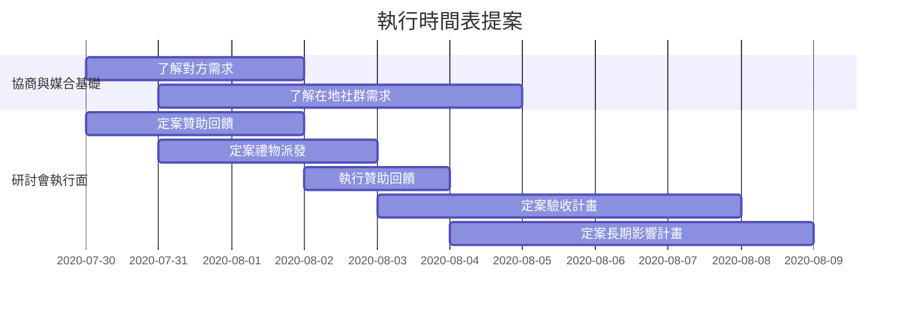

Sponsorship - Python Tricks
===

## Table of Contents

[TOC]

## 目的與策略

透過贊助的名義，強化在地與非在地 Python 社群成員間的交流

1. stake holder - tai (在地社群成員)
2. project owner - cynthia (在地社群成員)
3. realpython / Dan - (非在地社群成員)
4. someone in the Python TW community in the future (在地社群成員)

## 戰術與執行

### 素材

1. We are fans of Python Tricks
2. The author of Python Tricks, Dan, is also the owner of realpython (the website)
3. foreword written by Mariatta, who is also the keynote speaker of PyCon TW 2020 (this year)
    3-1. 中文版最近二刷，二刷裡面有保留同一篇序
    3-2. 填天瓏書單拿中文的 https://docs.google.com/spreadsheets/d/1SclSUnFsDd6Pi8YCjS3UDguTjEq60ydyNgyg4zYuF-A/edit#gid=0

### 執行提案

1. ~~利用 keynote 的關係尋求書本贊助~~ (莫名其妙要到了)
2. (TBD)[協商與媒合基礎]透過__了解 realpython/dan 會想要什麼? 曝光? networking?
3. (TBD)[協商與媒合基礎]在地社群裡誰的 career plan 可以跟 realpython 比較有關係？（超愛研究 python 語法的人？會眾裡也喜愛這本書的人？）
4. (TBD)[研討會執行面]如何宣傳贊助獎品？
    4-1. 和公關合作？和議程宣傳介紹 keynote 的時候合作？
5. (TBD)[研討會執行面]如何派發贊助獎品？
    5-1. 是否要找個人先來測試一下 redeem code?
6. (TBD)[研討會執行面]如何執行贊助回饋？
    6-1. 定案贊助回饋內容
    6-2. 找誰來執行？如何執行？
7. (TBD)[研討會執行面]如何驗收執行成果？（派發獎品：多少人領走獎品了？他們是誰？可以拉來參加籌備 PyCon TW 嗎？又有多少人從原本不知道 realpython 到知道 realpython？）
8. (TBD)[研討會執行面][long-term]這次的 lesson learned 或是留下的其他各種資源，可以怎麼樣幫助自己和社群中後面的人持續茁壯？

Project Timeline
---

## Appendix and FAQ

:::info
**Find this document incomplete?** Leave a comment!
:::

###### tags: `2020-organize` `2020-sponsorship` `sponsorship`
