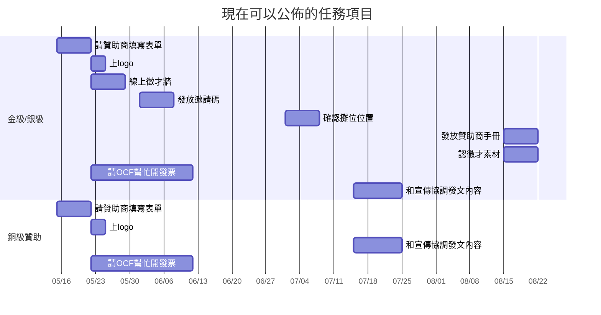

# 贊助執行任務介紹

### 組內溝通
- 雖有組長與組員之分，但每一位都有發表意見之自由。組長一職主要用來扛責任用，沒有明顯特權。~~組長只是去跪的~~
- 當你想到一件事，覺得需要做的時候，就直接發表到 discord，說說自己想法，並 tag  相關人物。如果不知道要發在哪裡應該 tag 誰可以發到 #team-marketing-sponsorship 然後 tag 小組長
- 很重要的事，還是以自己的事情、公司 / 學校的事 / 健康 為優先，畢竟 Pycon 是以志工形式來幫忙，大家都沒有義務。以自己的能力、健康為前提的情況下，再來幫忙組內事宜
- 需要協助（包含請人review），時程需要調整，都可以儘早跟小組長提起

### 任務要點
- 確認贊助商意向
- 執行回饋項目

### 任務項目

- 詳細內容可以看歷年的[工作手冊](https://docs.google.com/document/d/1a6uBQOgdRDepBsciMcwbzN8DMeCWoa-BG0osPVSwhxs/edit?usp=sharing)
- 有其他需要聯絡贊助商的項目，組長會在例會/channel上面和大家提起

###### tags: `2021-marketing` `2021-sponsorship` `marketing-plan` 